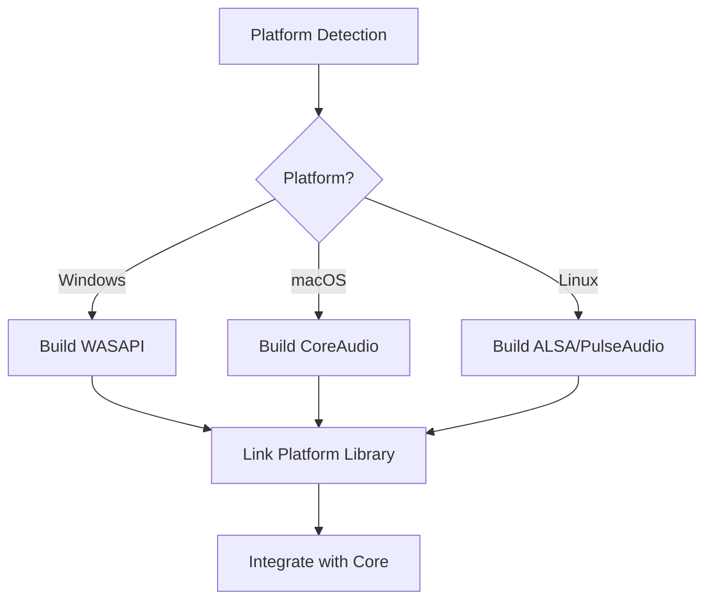
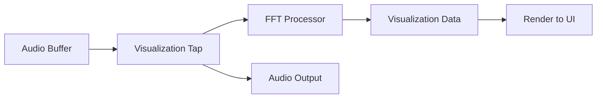

# Complete Development Design

## Objective

Complete all remaining development tasks to transform the Professional Music Player from Phase 1 implementation into a fully functional, cross-platform audio player with comprehensive features, platform support, and user interface.

## Background

### Current State

Based on the Windows build output and implementation progress:

**Completed Components:**
- Core engine with service registry and event bus
- Configuration manager with JSON persistence
- Playback engine with gapless architecture
- ALSA audio output (Linux-specific)
- FLAC and WAV decoder plugins
- Comprehensive documentation (Audio Pipeline, Plugin Development Guide)
- Unit tests for core components

**Build Issues Identified (Windows):**
- ALSA not found (expected - Linux-only)
- PkgConfig not found (affects FLAC detection on Windows)
- FLAC library not found (needs vcpkg or manual installation)
- GTest not found (needs installation for unit tests)
- GPU rendering not implemented

**Missing Platform Support:**
- Windows audio output (WASAPI)
- macOS audio output (CoreAudio)

**Missing Features:**
- User interface
- Playlist management
- Metadata reading and library management
- Additional decoder plugins (MP3, Vorbis, Opus, etc.)
- DSP plugin framework
- Visualization support

## Strategic Approach

### Development Phases

The completion strategy follows a prioritized, incremental approach:

| Phase | Focus | Target Timeline | Success Criteria |
|-------|-------|----------------|------------------|
| **Phase 2** | Platform Completeness | Weeks 1-4 | Functional playback on all platforms |
| **Phase 3** | Essential Features | Weeks 5-8 | Basic UI, playlists, metadata |
| **Phase 4** | Enhanced Features | Weeks 9-12 | DSP chain, advanced UI, visualizations |
| **Phase 5** | Polish & Distribution | Weeks 13-16 | Testing, optimization, packaging |

### Quality Gates

Each phase must meet these criteria before proceeding:
- All critical features implemented
- Zero compilation errors
- Unit tests passing (coverage > 70%)
- Platform-specific testing completed
- Documentation updated

## Phase 2: Platform Completeness

### Goal
Ensure functional audio playback on Windows, macOS, and Linux with proper dependency management.

### 2.1 Windows Audio Output (WASAPI)

#### Scope
Implement Windows Audio Session API backend for low-latency audio playback.

#### Component Structure

**File:** `platform/windows/audio_output_wasapi.cpp`

**Class:** `AudioOutputWASAPI` implementing `IAudioOutput`

#### Key Capabilities

| Capability | Implementation Strategy |
|------------|------------------------|
| Device Enumeration | Use IMMDeviceEnumerator to list audio endpoints |
| Exclusive Mode | AUDCLNT_SHAREMODE_EXCLUSIVE for lowest latency (3-10ms) |
| Shared Mode | AUDCLNT_SHAREMODE_SHARED as fallback (10-20ms) |
| Format Negotiation | Try requested format, fallback to device default |
| Event-Driven Playback | Use IAudioClient::GetService with event-driven callback |
| Error Recovery | Handle device removal, format changes gracefully |

#### Threading Model

- **Control Thread:** Main thread for open, start, stop, close operations
- **Playback Thread:** Dedicated high-priority thread waiting on event signals
- **Callback Execution:** Invokes user callback when buffer space available

#### Sample Format Priority

Attempt formats in order of preference:
1. Float32 (native WASAPI format, preferred for DSP)
2. Int32 (high-resolution integer)
3. Int24 (packed in 32-bit)
4. Int16 (fallback for compatibility)

#### Configuration Options

| Option | Description | Default |
|--------|-------------|---------|
| Exclusive Mode | Enable exclusive device access | false |
| Buffer Duration | Target buffer size in milliseconds | 20ms |
| Event Mode | Use event-driven vs. polling | true |
| Auto Convert Format | Let WASAPI convert format if needed | true |

### 2.2 macOS Audio Output (CoreAudio)

#### Scope
Implement CoreAudio backend using Audio Unit framework.

#### Component Structure

**File:** `platform/macos/audio_output_coreaudio.cpp`

**Class:** `AudioOutputCoreAudio` implementing `IAudioOutput`

#### Key Capabilities

| Capability | Implementation Strategy |
|------------|------------------------|
| Device Enumeration | AudioObjectGetPropertyData with kAudioHardwarePropertyDevices |
| Output Unit | kAudioUnitSubType_DefaultOutput Audio Unit |
| Format Setup | AudioStreamBasicDescription configuration |
| Render Callback | AURenderCallback for pull-based audio delivery |
| Sample Rate Matching | Prefer device native sample rate to avoid resampling |
| Device Changes | kAudioDevicePropertyDeviceIsAlive listener |

#### Threading Model

- **Control Thread:** Main thread for device enumeration and configuration
- **Render Callback:** CoreAudio thread (real-time priority, never block)

#### Sample Format Configuration

CoreAudio native format:
- **Format ID:** kAudioFormatLinearPCM
- **Format Flags:** kAudioFormatFlagIsFloat | kAudioFormatFlagIsPacked
- **Bits Per Channel:** 32 (Float32)
- **Bytes Per Frame:** channels × 4

#### Configuration Options

| Option | Description | Default |
|--------|-------------|---------|
| Buffer Size | Preferred buffer size in frames | 512 |
| Sample Rate | Preferred sample rate (0 = device default) | 0 |
| High Priority | Request real-time scheduling priority | true |

### 2.3 Platform Abstraction Updates

#### CMake Build System Enhancements

**Conditional Compilation Strategy:**



**File Modifications Required:**

| File | Changes |
|------|---------|
| `platform/CMakeLists.txt` | Add conditional Windows/macOS sources |
| `CMakeLists.txt` | Platform-specific library linkage |
| `core/core_engine.cpp` | Factory function for platform-appropriate audio output |

#### Platform Factory Pattern

**Design Pattern:** Factory method returning platform-specific IAudioOutput implementation

**Factory Function Signature:**

```
create_platform_audio_output() -> IAudioOutput*
```

**Selection Logic:**
- Windows: Return AudioOutputWASAPI instance
- macOS: Return AudioOutputCoreAudio instance
- Linux: Return AudioOutputALSA instance (fallback to PulseAudio if ALSA unavailable)

**Integration Point:** Core engine initialization

### 2.4 Dependency Management

#### Windows Dependencies

**Required Libraries:**
- Windows SDK (for WASAPI headers and libraries)
- Included with Visual Studio

**CMake Configuration:**
- No external package manager required
- Link against system libraries: ole32.lib, winmm.lib

#### macOS Dependencies

**Required Frameworks:**
- AudioUnit.framework
- CoreAudio.framework
- CoreFoundation.framework

**CMake Configuration:**

```
Target framework linkage:
- AudioUnit
- CoreAudio
- CoreFoundation
```

#### Linux Dependencies

**Current:** ALSA (conditional)

**Enhancement:** PulseAudio fallback

| Library | Purpose | Detection Method |
|---------|---------|------------------|
| ALSA | Primary Linux audio backend | find_package(ALSA) |
| PulseAudio | Fallback for systems without ALSA | pkg-config libpulse |
| PipeWire | Future consideration | Not implemented yet |

**Runtime Selection Strategy:**
1. Attempt ALSA initialization
2. If ALSA fails, attempt PulseAudio
3. If both fail, report error to user

#### Cross-Platform Decoder Dependencies

**FLAC Decoder:**

| Platform | Installation Method | Detection |
|----------|-------------------|-----------|
| Windows | vcpkg install flac | vcpkg toolchain integration |
| macOS | brew install flac | pkg-config flac |
| Linux | apt/dnf install libflac-dev | pkg-config flac |

**MP3 Decoder (Future):**

**Library:** minimp3 (header-only, no dependencies)

**Advantages:**
- No external library required
- Single header file inclusion
- Permissive license (CC0)
- Cross-platform by default

## Phase 3: Essential Features

### Goal
Deliver minimum viable product with basic UI, playlist management, and metadata support.

### 3.1 Metadata Reader

#### Scope
Extract and manage audio file metadata (tags, album art, technical info).

#### Library Selection

**Chosen Library:** TagLib

**Justification:**
- Mature and widely used
- Supports all major formats (MP3, FLAC, Vorbis, Opus, AAC, WAV)
- C++ API with clean interfaces
- LGPL/MPL dual license (compatible with project)
- Active maintenance

#### Component Structure

**File:** `core/metadata_reader.h`, `core/metadata_reader.cpp`

**Class:** `MetadataReader`

#### Metadata Model

**Structure:** `TrackMetadata`

| Field | Type | Description |
|-------|------|-------------|
| title | string | Track title |
| artist | string | Primary artist name |
| album | string | Album name |
| album_artist | string | Album artist (if different from track artist) |
| genre | string | Genre classification |
| year | uint32 | Release year |
| track_number | uint32 | Track number in album |
| disc_number | uint32 | Disc number in multi-disc set |
| duration_ms | uint64 | Track duration in milliseconds |
| bitrate_kbps | uint32 | Average bitrate |
| sample_rate | uint32 | Sample rate in Hz |
| channels | uint16 | Channel count |
| codec | string | Codec name (e.g., "FLAC", "MP3") |
| album_art | BinaryData | Embedded album artwork (optional) |

#### Key Operations

| Operation | Thread Context | Performance Target |
|-----------|----------------|-------------------|
| Read Metadata | I/O Thread | < 50ms per file |
| Extract Album Art | I/O Thread | < 100ms per file |
| Batch Scan | Background Thread | 100+ files/second |

#### Caching Strategy

**Cache Location:** SQLite database (`metadata.db`)

**Cache Key:** File path + modification timestamp

**Cache Validation:** Check file mtime before using cached data

**Cache Invalidation:** Remove entries for non-existent files on startup

### 3.2 Playlist Management

#### Scope
Manage collections of tracks with persistence, searching, and manipulation.

#### Component Structure

**File:** `core/playlist_manager.h`, `core/playlist_manager.cpp`

**Class:** `PlaylistManager`

#### Playlist Model

**Entity: Playlist**

| Property | Type | Description |
|----------|------|-------------|
| id | uint64 | Unique playlist identifier |
| name | string | User-assigned playlist name |
| creation_time | timestamp | When playlist was created |
| modification_time | timestamp | Last modification timestamp |
| tracks | vector&lt;TrackReference&gt; | Ordered list of tracks |

**Entity: TrackReference**

| Property | Type | Description |
|----------|------|-------------|
| file_path | string | Absolute path to audio file |
| metadata_hash | uint64 | Hash of cached metadata |
| added_time | timestamp | When track was added to playlist |

#### Storage Format

**Format:** JSON (human-readable, easy to edit)

**Location:** `playlists/` directory in user config folder

**File Naming:** `{playlist_name}.json`

#### Key Operations

| Operation | Description | Performance Target |
|-----------|-------------|-------------------|
| Create Playlist | Initialize new empty playlist | Instant |
| Add Tracks | Append tracks to playlist | < 1ms per track |
| Remove Tracks | Remove by index or path | < 1ms |
| Reorder Tracks | Change track order (drag-drop) | < 10ms |
| Search Tracks | Find tracks by metadata query | < 100ms for 10k tracks |
| Load Playlist | Read from disk | < 100ms |
| Save Playlist | Write to disk | < 100ms |

#### Playlist Features

**Basic Features (Phase 3):**
- Create, delete, rename playlists
- Add files or folders
- Remove tracks
- Reorder tracks (move up/down)
- Duplicate detection (optional warning)

**Advanced Features (Phase 4):**
- Smart playlists (dynamic based on metadata criteria)
- Playlist folders/organization
- Import/export M3U, PLS formats
- Shuffle and repeat modes
- Queue management

### 3.3 User Interface Foundation

#### Scope
Implement minimal playback control interface using immediate-mode GUI framework.

#### Framework Selection

**Chosen Framework:** Dear ImGui

**Justification:**
- Lightweight (single-header core)
- Immediate-mode paradigm (simple state management)
- Excellent for tools and utilities
- Cross-platform rendering backends available
- No external UI framework dependencies
- Easy integration with OpenGL, DirectX, Vulkan

#### Rendering Backend Strategy

| Platform | Backend | Integration |
|----------|---------|-------------|
| Windows | DirectX 11 | ImGui_ImplDX11 + Win32 window |
| macOS | Metal | ImGui_ImplMetal + Cocoa window |
| Linux | OpenGL 3 | ImGui_ImplOpenGL3 + GLFW window |

**Alternative (Unified):** GLFW + OpenGL 3 for all platforms (simpler but less optimal)

#### UI Component Structure

**File:** `ui/main_window.h`, `ui/main_window.cpp`

**Class:** `MainWindow`

#### UI Layout

```
┌─────────────────────────────────────────────────┐
│ Menu Bar: File | View | Playback | Help        │
├─────────────────────────────────────────────────┤
│                                                 │
│  Playlist Panel        │  Now Playing Panel     │
│  ┌──────────────────┐  │  ┌──────────────────┐  │
│  │ Track List       │  │  │ Album Art        │  │
│  │ 1. Song A        │  │  │                  │  │
│  │ 2. Song B (▶)    │  │  │   [Album Art]    │  │
│  │ 3. Song C        │  │  │                  │  │
│  │ ...              │  │  │                  │  │
│  │                  │  │  └──────────────────┘  │
│  └──────────────────┘  │  Title: Song B         │
│                        │  Artist: Artist Name   │
│                        │  Album: Album Name     │
│                        │  Duration: 3:45        │
└────────────────────────┴────────────────────────┘
│ ◀◀  ▶/⏸  ▶▶  [━━━━━━━━━━━━━━ 1:32 / 3:45]   🔊 │
└─────────────────────────────────────────────────┘
```

#### UI Components

**Playlist Panel:**
- Scrollable track list with virtual scrolling (for large playlists)
- Columns: # | Title | Artist | Album | Duration
- Context menu: Remove, Move to Queue, Properties
- Drag-and-drop reordering

**Now Playing Panel:**
- Album artwork display (scaled to fit)
- Track metadata display (title, artist, album, year)
- Waveform visualization (optional, Phase 4)

**Transport Controls:**
- Previous track button
- Play/Pause toggle button
- Next track button
- Seek bar with time display (current / total)
- Volume slider with mute button

**Menu Bar:**

| Menu | Items |
|------|-------|
| File | Open File(s), Open Folder, Exit |
| View | Toggle Playlist Panel, Toggle Now Playing Panel |
| Playback | Play, Pause, Stop, Previous, Next |
| Help | About, Documentation |

#### State Management

**Approach:** Single application state object

**State Structure:**

| State Category | Properties |
|----------------|------------|
| Playback State | Current track, position, play/pause status |
| Playlist State | Active playlist, selected tracks |
| UI State | Panel visibility, window size/position |
| Configuration | Theme, font size, column widths |

**State Persistence:** Saved to configuration manager on exit

#### Event Integration

**Event Flow:**


**Event Types:**

| Event | Trigger | Handler |
|-------|---------|---------|
| PlayRequested | Play button clicked | PlaybackEngine::play() |
| PauseRequested | Pause button clicked | PlaybackEngine::pause() |
| SeekRequested | Seek bar dragged | PlaybackEngine::seek() |
| TrackSelected | Track double-clicked | Load track and play |
| VolumeChanged | Volume slider moved | PlaybackEngine::set_volume() |

## Phase 4: Enhanced Features

### Goal
Add advanced capabilities: DSP processing, visualization, extended codec support.

### 4.1 DSP Plugin Framework

#### Scope
Enable audio processing plugins for effects, equalization, and audio enhancement.

#### DSP Plugin Interface

**Specified in:** `docs/AUDIO_PIPELINE.md` (already designed)

**SDK Header:** `sdk/headers/mp_dsp.h`

#### DSP Plugin Types

| Plugin Type | Purpose | Examples |
|-------------|---------|----------|
| Volume Control | Gain adjustment, ReplayGain | Normalize, amplify |
| Equalizer | Frequency-based filtering | 10-band EQ, parametric EQ |
| Compressor | Dynamic range control | Limiter, compressor |
| Spatial | Stereo field manipulation | Crossfeed, stereo widening |
| Resampler | Sample rate conversion | High-quality SRC |

#### DSP Chain Architecture

**Design Pattern:** Chain of Responsibility

**Processing Flow:**

```
[Audio Input] 
    ↓
[DSP Plugin 1: ReplayGain] 
    ↓
[DSP Plugin 2: Equalizer]
    ↓
[DSP Plugin 3: Crossfeed]
    ↓
[Format Converter]
    ↓
[Audio Output]
```

**Chain Management:**

| Operation | Description |
|-----------|-------------|
| Insert Plugin | Add plugin at specific position in chain |
| Remove Plugin | Remove plugin from chain |
| Reorder Plugins | Change processing order |
| Bypass Plugin | Skip plugin without removal |
| Get Latency | Sum of all plugin latencies |

#### Real-Time Constraints

**Critical Requirements:**
- No memory allocation during process()
- No locks during process()
- No I/O during process()
- Process() must complete within time budget

**Time Budget Calculation:**

For buffer size N frames at sample rate SR:
- Available time = (N / SR) × 1000 ms
- Target usage: < 50% of available time
- Example: 2048 frames @ 44.1kHz = 46ms available, target < 23ms

#### Sample DSP Plugins (Bundled)

**1. Volume Control Plugin**

Purpose: Apply gain adjustment and ReplayGain

Parameters:
- Gain (dB): -60 to +12 dB
- ReplayGain Mode: Off, Track, Album

**2. 10-Band Equalizer Plugin**

Purpose: Frequency-based audio shaping

Bands (Hz): 31, 62, 125, 250, 500, 1k, 2k, 4k, 8k, 16k

Parameters per band:
- Gain: -12 to +12 dB

**3. Crossfeed Plugin**

Purpose: Reduce stereo fatigue on headphones

Parameters:
- Crossfeed strength: 0% to 100%
- Frequency cutoff: 500 to 2000 Hz

### 4.2 Extended Codec Support

#### Target Formats

| Format | Priority | Library | License |
|--------|----------|---------|---------|
| MP3 | High | minimp3 (decode only) | CC0 |
| Vorbis | High | libvorbis | BSD-like |
| Opus | High | libopus | BSD |
| AAC | Medium | libfdk-aac (decode only) | Permissive |
| WavPack | Medium | libwavpack | BSD |
| Musepack | Low | libmpcdec | BSD |

#### Decoder Plugin Pattern

Each decoder follows the same implementation pattern:

**Files:**
- `plugins/decoders/{format}_decoder.cpp`
- CMake integration in `plugins/decoders/CMakeLists.txt`

**Implementation Checklist:**
- Implement IDecoder interface
- File format detection (probe function)
- Stream info extraction
- Sample-accurate decoding
- Seek support (if format supports seeking)
- Metadata extraction
- Error handling with graceful degradation

#### Conditional Compilation

**Strategy:** Same as FLAC decoder

- If library found: Full decoder implementation
- If library not found: Stub implementation with error message
- CMake defines: NO_MP3, NO_VORBIS, NO_OPUS, etc.

### 4.3 Visualization Support

#### Scope
Provide real-time audio visualization capabilities.

#### Visualization Types

| Visualization | Description | Complexity |
|---------------|-------------|------------|
| Waveform | Time-domain amplitude display | Low |
| Spectrum Analyzer | Frequency-domain display (FFT) | Medium |
| Spectrogram | Time-frequency waterfall display | Medium |
| VU Meter | Peak and RMS level indicators | Low |

#### Architecture

**Component:** `VisualizationEngine`

**Data Source:** Tap into audio pipeline before output

**Processing:**



#### Waveform Visualization

**Implementation:**
- Ring buffer storing last N seconds of audio
- Downsampling for display (render max/min per pixel)
- Render as line graph in UI panel

**Parameters:**
- Time window: 1-10 seconds
- Update rate: 30-60 FPS

#### Spectrum Analyzer

**Implementation:**
- FFT size: 2048 or 4096 samples
- Window function: Hann window
- Frequency bins: Map to visual bars (logarithmic spacing)
- Smoothing: Exponential averaging for stable display

**Parameters:**
- FFT size: 1024, 2048, 4096
- Frequency range: 20 Hz - 20 kHz
- Bar count: 20-100 bars
- Color scheme: Gradient (green → yellow → red)

#### Performance Considerations

**Optimization Strategy:**
- Compute visualizations in separate low-priority thread
- Never block audio thread for visualization
- Use GPU for rendering (if available)
- Downsample data for efficient rendering

## Phase 5: Polish & Distribution

### Goal
Prepare application for public release with testing, optimization, and packaging.

### 5.1 Comprehensive Testing

#### Test Strategy

| Test Category | Coverage Target | Tools |
|---------------|----------------|-------|
| Unit Tests | > 70% code coverage | GTest, GMock |
| Integration Tests | All feature workflows | Manual + automated scripts |
| Platform Tests | All supported platforms | CI/CD pipeline |
| Performance Tests | Meet latency/CPU targets | Custom benchmarks |
| Memory Tests | Zero leaks | Valgrind, Dr. Memory, Instruments |

#### Unit Test Scope

**Existing Tests:**
- Configuration manager (test_config_manager.cpp)
- Event bus (test_event_bus.cpp)

**Additional Test Modules:**

| Module | Test File | Key Test Cases |
|--------|-----------|----------------|
| Playback Engine | test_playback_engine.cpp | Track loading, gapless transition, seek accuracy |
| Playlist Manager | test_playlist_manager.cpp | Add/remove tracks, persistence, search |
| Metadata Reader | test_metadata_reader.cpp | Tag extraction, cache validation |
| Audio Output | test_audio_output.cpp | Device enumeration, format negotiation, callback timing |
| Decoder Plugins | test_decoders.cpp | Format detection, decoding accuracy, seeking |
| DSP Plugins | test_dsp.cpp | Processing correctness, latency reporting |

#### Integration Test Scenarios

| Scenario | Validation Criteria |
|----------|---------------------|
| End-to-End Playback | Load file → decode → process → output without errors |
| Gapless Transition | No audible gap between consecutive tracks |
| Device Hot-Plug | Graceful handling of device removal/addition during playback |
| Playlist Import | Correctly load M3U/PLS playlists with relative paths |
| Large Library Scan | Successfully scan and cache metadata for 10,000+ files |

#### Performance Benchmarks

**Audio Pipeline Latency:**
- Measure time from playback start to first audio output
- Target: < 100ms

**CPU Usage:**
- Measure during playback of various formats
- Target: < 5% CPU on modern systems (excluding visualization)

**Memory Usage:**
- Monitor over 24-hour continuous playback
- Target: < 100 MB steady-state, zero leaks

### 5.2 Optimization

#### Performance Optimization Areas

| Area | Optimization Technique |
|------|------------------------|
| Audio Decoding | SIMD instructions for format conversion |
| DSP Processing | Vectorized operations (SSE, AVX on x86) |
| Metadata Scanning | Multi-threaded batch processing |
| UI Rendering | Minimize redraws, use GPU acceleration |
| Memory Usage | Object pooling for audio buffers |

#### Binary Size Optimization

**Techniques:**
- Link-time optimization (LTO)
- Strip debug symbols in release builds
- Minimize static library inclusion
- Compress resources (icons, fonts)

**Target:** < 10 MB base application (excluding plugins and libraries)

### 5.3 Packaging and Distribution

#### Windows Packaging

**Installer:** NSIS or WiX Toolset

**Package Contents:**
- music-player.exe
- Required DLLs (if not using static linking)
- Plugin DLLs in plugins/ subdirectory
- Documentation (README.html)
- License file
- Uninstaller

**Installation Features:**
- Program Files installation
- Start menu shortcuts
- File association registration (.flac, .mp3, .wav, etc.)
- Add to PATH (optional)

**Distribution:** GitHub Releases, Microsoft Store (future)

#### macOS Packaging

**Format:** .app bundle + DMG installer

**Bundle Structure:**
```
MusicPlayer.app/
├── Contents/
│   ├── MacOS/
│   │   └── music-player (executable)
│   ├── Resources/
│   │   ├── AppIcon.icns
│   │   └── plugins/
│   ├── Frameworks/ (embedded libraries)
│   └── Info.plist
```

**Code Signing:** Apple Developer ID certificate (required for Gatekeeper)

**Distribution:** GitHub Releases, Homebrew cask (future)

#### Linux Packaging

**Formats:**

| Format | Target Distribution | Tool |
|--------|-------------------|------|
| .deb | Debian, Ubuntu | dpkg-deb |
| .rpm | Fedora, RHEL, openSUSE | rpmbuild |
| AppImage | Universal | appimagetool |
| Flatpak | Universal (sandboxed) | flatpak-builder |

**Installation Paths:**
- Binary: /usr/bin/music-player
- Plugins: /usr/lib/music-player/plugins/
- Desktop file: /usr/share/applications/music-player.desktop
- Icon: /usr/share/icons/hicolor/*/apps/music-player.png

**Distribution:** GitHub Releases, Package repositories, Flathub

### 5.4 Documentation

#### User Documentation

**Format:** Markdown (converted to HTML for distribution)

**Documents:**

| Document | Audience | Content |
|----------|----------|---------|
| README.md | New users | Quick start, feature overview |
| USER_GUIDE.md | All users | Complete feature documentation |
| FAQ.md | Troubleshooting | Common issues and solutions |
| CHANGELOG.md | All users | Version history and changes |

**Hosting:** GitHub repository, GitHub Pages

#### Developer Documentation

**Existing:**
- docs/AUDIO_PIPELINE.md
- docs/PLUGIN_DEVELOPMENT_GUIDE.md

**Additional:**

| Document | Purpose |
|----------|---------|
| ARCHITECTURE.md | High-level system design overview |
| BUILDING.md | Detailed build instructions for all platforms |
| CONTRIBUTING.md | Contribution guidelines and code standards |
| API_REFERENCE.md | Complete API documentation (Doxygen-generated) |

## Technical Decisions

### Cross-Platform Strategy

**Principle:** Use platform-native APIs where performance critical, cross-platform libraries elsewhere

**Rationale:**
- Audio output: Platform APIs provide lowest latency and best integration
- UI: ImGui provides sufficient cross-platform capability without heavy framework
- File I/O: Standard C++ std::filesystem is sufficient
- Threading: std::thread with platform-specific priority adjustments

### Dependency Philosophy

**Guideline:** Minimize external dependencies, prefer lightweight libraries

**Acceptable Dependencies:**
- Audio codecs: Industry-standard libraries (libflac, libvorbis, etc.)
- Metadata: TagLib (widely used, stable)
- UI: Dear ImGui (single-header, minimal)
- Testing: GTest (standard for C++)

**Avoided Dependencies:**
- Qt (too heavy for microkernel architecture)
- Boost (prefer C++17 standard library where possible)
- FFmpeg (use individual codec libraries to avoid bloat)

### UI Philosophy

**Approach:** Functional minimalism

**Design Principles:**
- Prioritize functionality over visual flair
- Keyboard shortcuts for all common operations
- Responsive and efficient (no UI lag)
- Customizable but not overwhelming

**Inspiration:** foobar2000 default UI (simple, information-dense, efficient)

## Risk Assessment

### Technical Risks

| Risk | Probability | Impact | Mitigation |
|------|-------------|--------|------------|
| Platform audio API complexity | Medium | High | Study existing implementations (miniaudio, RtAudio), incremental testing |
| ImGui learning curve | Low | Medium | Abundant examples available, active community |
| Codec library integration issues | Medium | Medium | Conditional compilation, graceful degradation |
| Performance targets not met | Low | High | Early benchmarking, iterative optimization |
| Cross-platform build complexity | Medium | Medium | CI/CD pipeline for automated testing |

### Resource Risks

| Risk | Probability | Impact | Mitigation |
|------|-------------|--------|------------|
| Development time exceeds estimate | High | Medium | Prioritize phases, accept reduced scope for later phases if needed |
| Limited platform testing resources | Medium | High | Use virtual machines, cloud CI services (GitHub Actions) |
| Insufficient expertise in platform APIs | Low | Medium | Comprehensive research, reference implementations |

## Success Metrics

### Functional Completeness

| Metric | Target | Measurement |
|--------|--------|-------------|
| Platform Support | Windows + macOS + Linux functional | Manual testing on each platform |
| Format Support | Minimum 5 formats (WAV, FLAC, MP3, Vorbis, Opus) | Successful playback of test files |
| UI Completeness | All planned components implemented | Checklist verification |
| Feature Parity | Core features match design | Feature matrix comparison |

### Quality Metrics

| Metric | Target | Measurement |
|--------|--------|-------------|
| Crash Rate | < 0.1% sessions | Crash reporting (if implemented) |
| Audio Quality | Bit-perfect for lossless formats | Null sum test |
| Latency | < 100ms startup, < 50ms seek | Automated timing tests |
| CPU Usage | < 5% during playback | System monitoring |
| Memory Usage | < 100 MB, zero leaks | Valgrind, Dr. Memory |

### User Experience Metrics

| Metric | Target | Measurement |
|--------|--------|-------------|
| Installation Success | > 95% | User feedback, issue reports |
| First-Time Usability | User can play file within 1 minute | Usability testing |
| Documentation Clarity | < 10% "unclear" feedback | User surveys |

## Implementation Roadmap

### Week-by-Week Breakdown

#### Weeks 1-4: Phase 2 (Platform Completeness)

| Week | Focus | Deliverables |
|------|-------|--------------|
| 1 | Windows WASAPI | Audio output working on Windows |
| 2 | macOS CoreAudio | Audio output working on macOS |
| 3 | Dependency management | vcpkg/Homebrew integration, FLAC builds on all platforms |
| 4 | Platform testing | Cross-platform CI, all platforms build and run |

#### Weeks 5-8: Phase 3 (Essential Features)

| Week | Focus | Deliverables |
|------|-------|--------------|
| 5 | Metadata reader | TagLib integration, metadata extraction working |
| 6 | Playlist manager | Playlist CRUD operations, persistence |
| 7 | ImGui UI foundation | Window creation, basic layout |
| 8 | UI integration | Connect UI to playback engine, interactive controls |

#### Weeks 9-12: Phase 4 (Enhanced Features)

| Week | Focus | Deliverables |
|------|-------|--------------|
| 9 | DSP framework | DSP plugin interface, chain processor |
| 10 | Sample DSP plugins | Volume, EQ, crossfeed plugins |
| 11 | Extended codecs | MP3, Vorbis, Opus decoders |
| 12 | Visualization | Waveform and spectrum analyzer |

#### Weeks 13-16: Phase 5 (Polish & Distribution)

| Week | Focus | Deliverables |
|------|-------|--------------|
| 13 | Testing | Comprehensive unit and integration tests |
| 14 | Optimization | Performance tuning, memory profiling |
| 15 | Packaging | Installers for all platforms |
| 16 | Documentation & release | Complete docs, GitHub release |

### Parallel Workstreams

Where possible, work can proceed in parallel:

- **Workstream A (Core):** Playback engine enhancements, DSP framework
- **Workstream B (Platform):** Platform-specific audio outputs
- **Workstream C (UI):** User interface implementation
- **Workstream D (Content):** Decoder plugins, metadata

## Architectural Alignment

### Microkernel Principles Maintained

All new components adhere to the established microkernel architecture:

**Core Remains Minimal:**
- No new core functionality beyond service registry extensions
- All features implemented as services or plugins

**Plugin-First Approach:**
- DSP processing: Plugin architecture
- Decoders: Plugin architecture
- Visualizations: Pluggable components

**Service-Oriented:**
- Metadata reader: Registered service
- Playlist manager: Registered service
- Configuration access: Service registry

**Platform Abstraction:**
- Audio output: Platform-specific implementations behind common interface
- UI windowing: Platform backends behind common API

### Thread Safety

All components respect the established thread model:

**Audio Thread:**
- Real-time constraints enforced
- No allocations, locks, or I/O
- Only playback engine and DSP plugins execute here

**I/O Thread:**
- File operations, network streaming
- Decoder execution
- Metadata extraction

**UI Thread:**
- Event handling
- Rendering
- User interaction

## Dependencies Summary

### Build-Time Dependencies

| Dependency | Platforms | Purpose | Optional |
|------------|-----------|---------|----------|
| CMake 3.20+ | All | Build system | No |
| C++17 Compiler | All | Compilation | No |
| Windows SDK | Windows | WASAPI headers | No |
| Xcode Tools | macOS | CoreAudio, Metal | No |
| ALSA Dev | Linux | Audio output | Yes |
| PkgConfig | Linux, macOS | Library detection | Yes |

### Runtime Dependencies (Libraries)

| Library | Purpose | License | Optional |
|---------|---------|---------|----------|
| libflac | FLAC decoding | BSD-like | Yes |
| libvorbis | Vorbis decoding | BSD-like | Yes |
| libopus | Opus decoding | BSD | Yes |
| TagLib | Metadata extraction | LGPL/MPL | No |
| Dear ImGui | UI framework | MIT | No |

### Development Dependencies

| Tool | Purpose |
|------|---------|
| GTest | Unit testing |
| Doxygen | API documentation generation |
| Clang-format | Code formatting |
| Valgrind/Dr. Memory | Memory leak detection |

## Confidence Assessment

**Overall Confidence: Medium-High**

**Confidence Basis:**

**High Confidence Factors:**
- Core architecture already proven and functional
- Platform APIs well-documented with examples
- Libraries (TagLib, ImGui) mature and widely used
- Clear specifications already exist (Audio Pipeline doc)
- Similar projects exist as reference (foobar2000, Audacious, Clementine)

**Medium Confidence Factors:**
- Platform-specific audio implementation requires deep API knowledge
- Gapless playback correctness needs extensive testing
- Performance targets (latency, CPU) require optimization iteration
- Cross-platform testing requires access to all platforms

**Risk Factors:**
- Timeline may be ambitious for single developer
- Platform-specific edge cases may surface late
- Third-party library API changes or compatibility issues
- UI/UX design requires iteration based on user feedback
