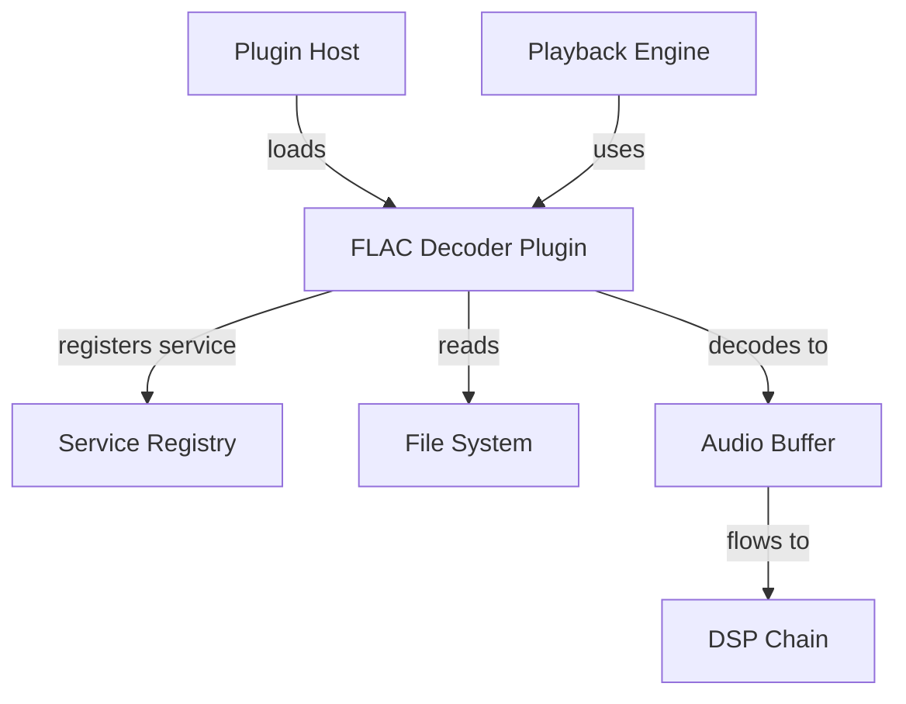
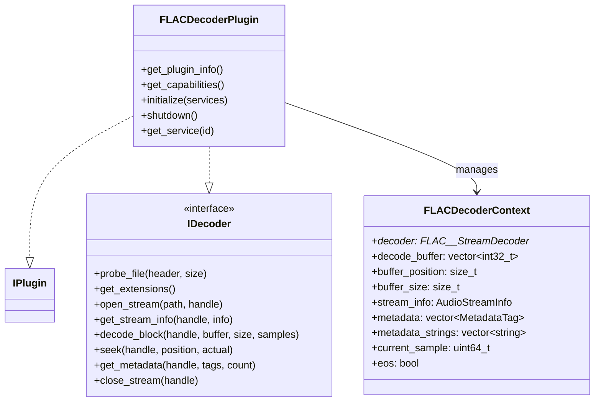
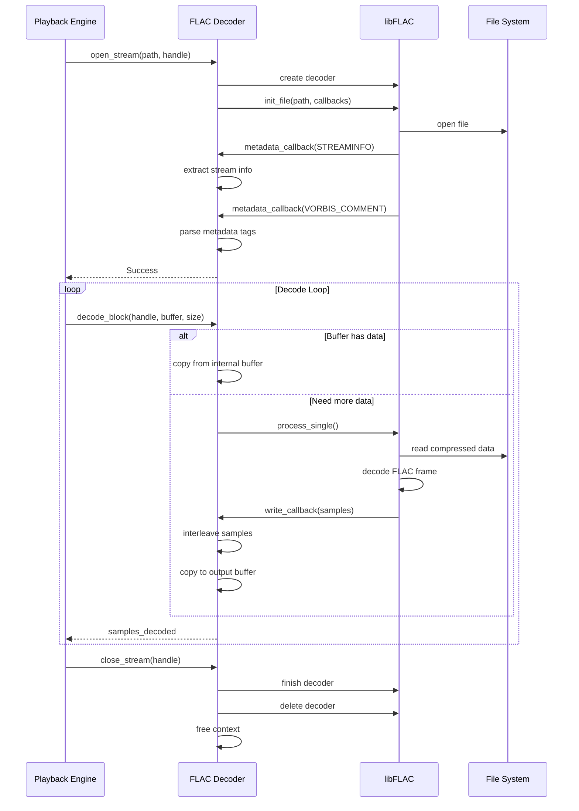

# FLAC Decoder Plugin Design

## Overview

This design specifies a FLAC audio decoder plugin for the Professional Music Player. The decoder will leverage the libFLAC library to decode FLAC audio files to PCM format, integrating seamlessly with the existing plugin architecture and audio pipeline.

## Design Goals

### Primary Objectives
- Decode FLAC files to high-quality PCM audio
- Support all standard FLAC features including seeking and metadata extraction
- Integrate with the microkernel plugin architecture
- Maintain real-time performance for gapless playback
- Support bit-perfect decoding for lossless audio preservation

### Non-Goals
- FLAC encoding capabilities
- FLAC file creation or editing
- Support for non-standard FLAC extensions

## System Context

### Plugin Architecture Integration

The FLAC decoder operates within the microkernel architecture as a decoder plugin, interacting with the following core components:



### Thread Context

The decoder operates in two distinct thread contexts:
- **Main Thread**: Plugin initialization, shutdown, and configuration
- **I/O Thread**: File opening, decoding, seeking, and metadata extraction

The decoder must be thread-safe for concurrent access to stream information queries while avoiding blocking operations.

## Functional Requirements

### File Format Support

The decoder shall support:
- FLAC native format with fLaC signature
- File extensions: .flac, .fla
- All standard FLAC compression levels (0-8)
- Subset FLAC streams (streamable subset)
- Non-subset FLAC streams (for high-resolution audio)

### Audio Specifications

| Parameter | Support Range |
|-----------|---------------|
| Sample Rates | 8 kHz to 655,350 Hz |
| Bit Depths | 4 to 32 bits per sample |
| Channels | 1 to 8 channels |
| Block Sizes | 16 to 65,535 samples |

Output format: 32-bit signed integer PCM (Int32) for maximum precision without floating-point conversion.

### Core Operations

#### File Probing
- Detect FLAC format by examining file header signature "fLaC" (0x66, 0x4C, 0x61, 0x43)
- Return confidence score of 100 for positive match, 0 otherwise
- Handle both native FLAC and Ogg-encapsulated FLAC if needed

#### Stream Opening
- Open FLAC file using libFLAC file-based API
- Parse STREAMINFO metadata block to extract audio parameters
- Extract Vorbis comments for metadata tags
- Initialize decoder state and allocate necessary buffers
- Validate file format and report errors for unsupported features

#### Audio Decoding
- Decode FLAC frames to interleaved PCM samples
- Buffer decoded samples for pull-based audio pipeline
- Handle variable block sizes efficiently
- Maintain sample-accurate position tracking
- Support continuous decoding without frame drops

#### Seeking
- Provide sample-accurate seeking to arbitrary positions
- Leverage SEEKTABLE metadata when available for efficient seeking
- Fall back to binary search when SEEKTABLE is absent
- Reset decoder state properly after seek operations
- Return actual seek position after completion

#### Metadata Extraction
- Parse Vorbis comments embedded in FLAC metadata
- Support standard tags: TITLE, ARTIST, ALBUM, ALBUMARTIST, DATE, GENRE, TRACKNUMBER, DISCNUMBER, COMMENT, COMPOSER
- Preserve case-insensitive tag key matching
- Handle multiple comments with the same key
- Store metadata strings with proper memory management

## Technical Architecture

### Component Structure



### Decoder State Management

Each open stream maintains its own decoder context containing:

| State Element | Purpose |
|---------------|---------|
| FLAC__StreamDecoder* | libFLAC decoder instance |
| decode_buffer | Interleaved PCM buffer for decoded samples |
| buffer_position | Current read position in decode buffer |
| buffer_size | Number of valid samples in decode buffer |
| stream_info | Cached audio stream information |
| metadata | Array of key-value metadata tags |
| metadata_strings | Storage for metadata string values |
| current_sample | Current playback position in samples |
| eos | End-of-stream flag |

### libFLAC Callback Architecture

The decoder utilizes three libFLAC callbacks:

#### Write Callback
- Invoked when libFLAC decodes a FLAC frame
- Receives decoded samples in planar format (separate arrays per channel)
- Converts planar samples to interleaved format for audio pipeline
- Stores samples in internal decode buffer
- Resets buffer position for consumption

#### Metadata Callback
- Invoked for each metadata block during initialization
- Processes STREAMINFO block to extract audio parameters
- Processes VORBIS_COMMENT blocks to extract tags
- Builds metadata tag array from Vorbis comments
- Calculates duration and bitrate estimates

#### Error Callback
- Receives error notifications from libFLAC
- Logs error messages for debugging
- Allows decoder to handle errors gracefully

### Decode Flow



## Data Flow Design

### Buffering Strategy

The decoder employs a two-stage buffering approach:

1. **libFLAC Internal Buffering**: Handles file I/O and compressed data
2. **Decode Buffer**: Stores interleaved PCM samples after decoding

Rationale: FLAC uses variable block sizes, so the decode buffer absorbs frame size variations and provides consistent sample delivery to the audio pipeline.

### Sample Format Conversion

| Source | Target | Conversion |
|--------|--------|------------|
| FLAC planar | Int32 interleaved | Direct copy with interleaving |
| 8-bit | Int32 | Expand to 32-bit with sign extension |
| 16-bit | Int32 | Expand to 32-bit with sign extension |
| 24-bit | Int32 | Expand to 32-bit with sign extension |

All FLAC samples decode to Int32 format to preserve full bit depth without precision loss.

### Seek Implementation

Seeking follows this algorithm:

1. Convert target position from milliseconds to sample number
2. Invoke libFLAC seek function with target sample
3. Clear internal decode buffer to prevent stale samples
4. Reset buffer position and end-of-stream flag
5. Update current sample position
6. Convert actual sample position back to milliseconds
7. Return actual position to caller

The libFLAC library handles:
- SEEKTABLE lookup if available
- Binary search through FLAC frames if no SEEKTABLE
- Frame boundary alignment

## Error Handling

### Error Categories and Recovery

| Error Type | Detection | Recovery Strategy |
|------------|-----------|-------------------|
| File not found | open_stream fails | Return FileNotFound result |
| Invalid FLAC format | init_file fails | Return InvalidFormat result |
| Corrupted frame | error_callback invoked | Log error, attempt to continue decoding |
| Seek failure | seek_absolute fails | Return Error result, maintain current position |
| Memory allocation failure | decoder creation fails | Return OutOfMemory result |
| End of stream | decoder state END_OF_STREAM | Set eos flag, return zero samples |

### Graceful Degradation

When encountering non-fatal errors:
- Continue playback when possible
- Skip corrupted frames rather than stopping playback
- Log warnings for diagnostic purposes
- Report errors through standard result codes

## Performance Considerations

### Latency Requirements

| Operation | Target | Rationale |
|-----------|--------|-----------|
| File opening | < 100ms | User-perceived responsiveness |
| Single decode call | < 10ms | Real-time audio thread requirements |
| Seek operation | < 50ms | Acceptable for local files |
| Metadata extraction | < 50ms | Part of file opening process |

### Memory Footprint

Estimated memory usage per decoder instance:

| Component | Size | Notes |
|-----------|------|-------|
| libFLAC decoder state | ~16 KB | Internal libFLAC structures |
| Decode buffer | Variable | Depends on block size, typically 8-64 KB for stereo |
| Metadata storage | Variable | Depends on tag count and length |
| Total | ~50-100 KB | Typical per-stream overhead |

### CPU Utilization

FLAC decoding is computationally efficient:
- FLAC is designed for fast decoding
- Typical CPU usage: < 1% on modern processors for 44.1kHz stereo
- No SIMD optimizations required for real-time performance
- Decoder should never block the audio thread

### I/O Optimization

- Use libFLAC's file-based API for efficient buffered I/O
- Let libFLAC manage file buffering and read-ahead
- Avoid unnecessary file seeks during sequential playback
- Minimize metadata processing overhead

## Build and Dependency Configuration

### External Dependency

The decoder requires libFLAC library:
- Minimum version: 1.3.0 (for stable API)
- Preferred version: 1.4.0+ (latest stable)
- Link against: FLAC library (libFLAC.so on Linux, FLAC.dll on Windows)

### Build System Integration

CMake configuration approach:

1. Use pkg-config to detect libFLAC installation
2. If libFLAC found: build fully functional decoder
3. If libFLAC not found: compile stub that returns NotSupported
4. Define NO_FLAC preprocessor symbol when libFLAC unavailable
5. Include libFLAC headers from system include paths
6. Link against libFLAC library when available

Build output:
- Shared library: flac_decoder.dll (Windows) or flac_decoder.so (Linux)
- No "lib" prefix on plugin file name
- Plugin discovery by filename pattern

### Conditional Compilation

All libFLAC-dependent code enclosed in:

```
#ifndef NO_FLAC
  // Full implementation
#else
  // Stub returning NotSupported
#endif
```

This allows the project to build even when libFLAC is unavailable, with graceful degradation.

## Plugin Interface Implementation

### Plugin Information

| Property | Value |
|----------|-------|
| Name | FLAC Decoder |
| Author | Music Player Team |
| Description | FLAC audio format decoder using libFLAC |
| Version | 1.0.0 |
| API Version | 0.1.0 |
| UUID | com.musicplayer.decoder.flac |
| Capabilities | PluginCapability::Decoder |

### Service Registration

The plugin registers itself with the service ID:
- Hash: `hash_string("mp.service.decoder")`
- Interface: `IDecoder*`

When queried via get_service, the plugin returns a pointer to its IDecoder interface implementation.

### Lifecycle Management

#### Initialization Sequence
1. Plugin host loads shared library
2. Calls create_plugin() exported function
3. Calls initialize() with service registry
4. Plugin logs initialization status
5. Returns Success or NotSupported based on libFLAC availability

#### Shutdown Sequence
1. Plugin host calls shutdown()
2. Plugin ensures all streams are closed
3. Plugin releases service registry reference
4. Plugin host calls destroy_plugin()
5. Shared library unloaded

## Integration with Audio Pipeline

### Format Compatibility

Output format specifications:
- Sample format: Int32 (32-bit signed integer)
- Channel layout: Interleaved (L, R, L, R, ...)
- Sample range: Full signed 32-bit range
- Byte order: Native system endianness

### Gapless Playback Support

The decoder supports gapless playback through:
- Sample-accurate total sample count from STREAMINFO
- Precise beginning and end-of-stream detection
- No artificial padding added to decoded samples
- Consistent sample positioning across seeks

### Dual Decoder Coordination

For gapless transitions:
- Playback engine may open two decoder instances simultaneously
- Each instance operates independently with separate state
- No shared state between decoder instances
- Thread-safe for concurrent decoding from different files

## Testing Considerations

### Functional Test Scenarios

| Test Case | Validation Criteria |
|-----------|---------------------|
| File probe detection | Correctly identifies FLAC files, rejects non-FLAC |
| Stream opening | Successfully opens valid FLAC files |
| Stream info accuracy | Reports correct sample rate, channels, duration |
| Decode correctness | Produces bit-perfect PCM output |
| Seeking accuracy | Seeks to correct sample position |
| Metadata parsing | Extracts all Vorbis comment tags |
| End-of-stream handling | Properly detects and reports end of file |
| Error handling | Gracefully handles corrupted files |

### Performance Validation

| Metric | Target | Measurement Method |
|--------|--------|-------------------|
| Decode latency | < 10ms per call | Time decode_block() execution |
| Seek latency | < 50ms | Time seek() execution |
| Memory usage | < 100 KB per instance | Measure resident memory after open |
| CPU usage | < 2% | Profile during continuous playback |

### Quality Assurance

Bit-perfect validation:
- Decode FLAC reference files to PCM
- Compare with reference PCM output byte-by-byte
- Verify no sample corruption or loss
- Test various bit depths: 16-bit, 24-bit, 32-bit
- Test various sample rates: 44.1kHz, 48kHz, 96kHz, 192kHz

## Open Questions and Assumptions

### Assumptions
- libFLAC library is available on target platforms
- File system supports standard file I/O operations
- Audio pipeline expects Int32 interleaved format
- Vorbis comment tags follow standard conventions
- FLAC files use native FLAC format (not Ogg-encapsulated)

### Future Enhancements
- Support for FLAC files in Ogg containers
- Embedded album art extraction (PICTURE metadata)
- ReplayGain metadata parsing and application
- Cue sheet support for album images
- Network stream support for FLAC over HTTP

## Dependencies

### Required Components
- libFLAC library (external)
- SDK headers: mp_plugin.h, mp_decoder.h, mp_types.h
- Standard library: iostream, vector, cstring, memory

### Service Dependencies
- Service Registry (for registration only, no runtime dependencies)

### No Dependencies On
- Other decoder plugins
- DSP plugins
- Audio output implementations
- Configuration manager
