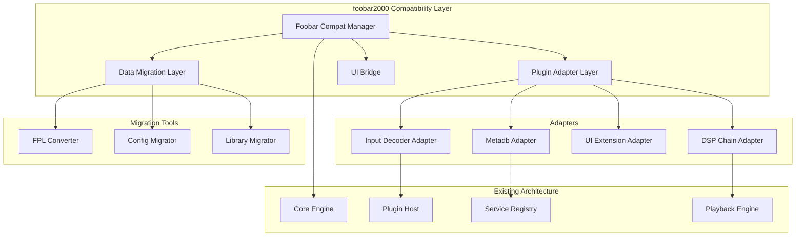
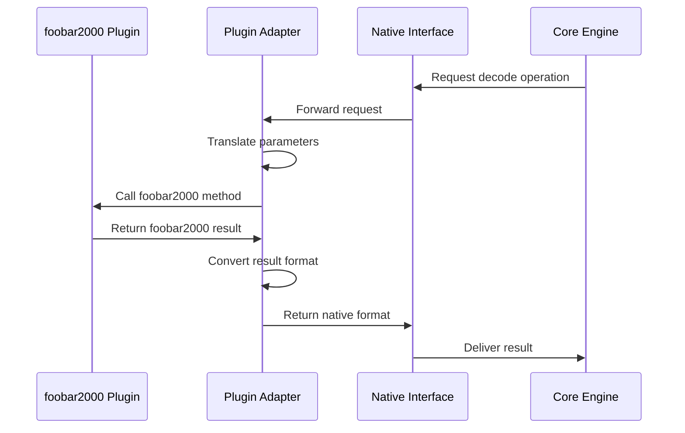
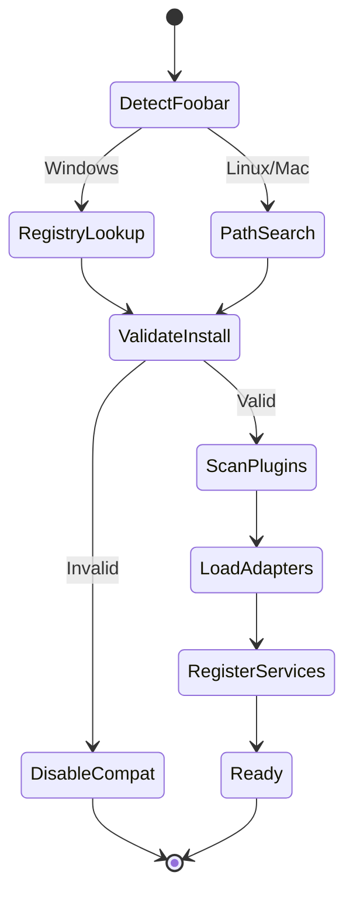
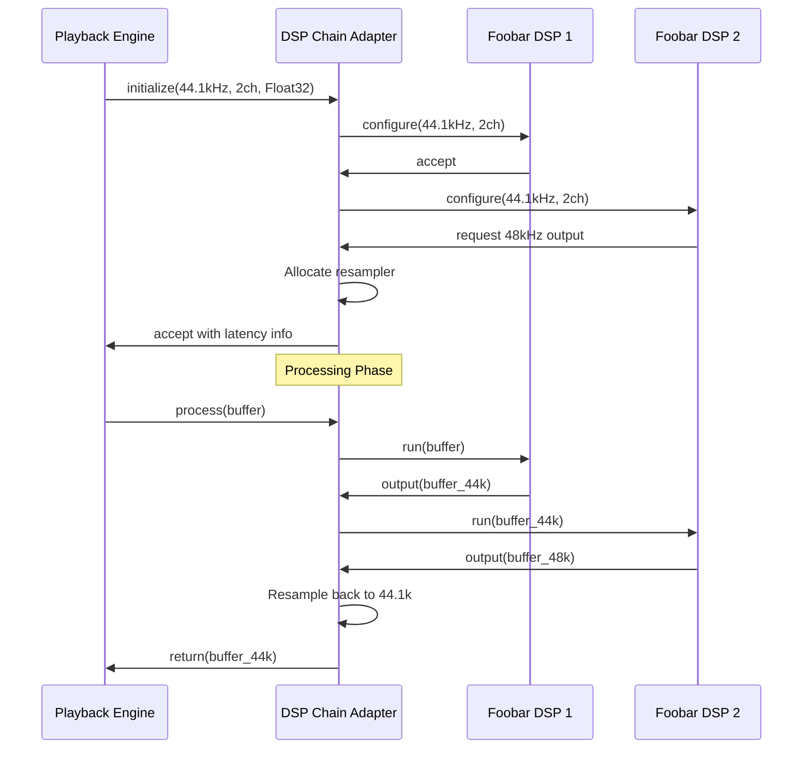
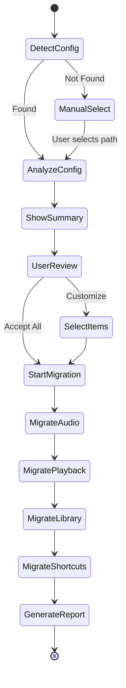

# foobar2000 Compatibility Implementation Design

## Executive Summary

This design document outlines the implementation strategy for achieving compatibility between the current music player and foobar2000, specifically focusing on plugin compatibility, data migration, and user experience continuity. Based on the compatibility analysis showing only 25% baseline compatibility, this design proposes a phased approach combining compatibility layers, adapter interfaces, and migration utilities.

### Strategic Approach

Rather than achieving full binary-level plugin compatibility (estimated 18-24 months), this design prioritizes:
- Plugin interface adaptation layer for common plugin types
- Data migration tooling for user playlists and configurations
- Architectural bridge patterns to enable foobar2000-style plugin development
- Gradual compatibility expansion based on user demand

### Compatibility Target

- **Phase 1**: Core plugin adapters and data migration (6-9 months)
- **Phase 2**: Extended plugin type support and UI compatibility (6-9 months)
- **Phase 3**: Advanced features and ecosystem integration (6-12 months)

## Design Principles

### Architectural Integrity

The compatibility layer must not compromise the existing microkernel architecture. All foobar2000 compatibility features will be implemented as:
- Optional build-time feature (ENABLE_FOOBAR_COMPAT flag)
- Separate compatibility module hierarchy
- Bridge pattern between native and foobar2000 interfaces
- Zero performance impact when disabled

### API Separation

Two distinct plugin ecosystems will coexist:
- **Native Plugins**: Using mp::IPlugin and related interfaces
- **Adapted foobar2000 Plugins**: Through compatibility adapters
- Clear documentation distinguishing both approaches
- Recommendation to develop new plugins using native API

### User Experience Priority

Focus on smooth migration path:
- Automatic detection of foobar2000 installations
- One-click data migration wizards
- Clear messaging about compatibility limitations
- Graceful degradation when features unavailable

## Architecture Overview

### Component Hierarchy

### Interface Adaptation Strategy

## Detailed Component Design

### 1. Foobar2000 Compatibility Manager

#### Responsibility
Central coordinator for all foobar2000 compatibility features, managing initialization, plugin discovery, and feature detection.

#### Key Operations

| Operation | Description | Constraints |
|-----------|-------------|-------------|
| Initialize Compatibility | Detect foobar2000 installation, scan for plugins | Optional, fails gracefully if foobar2000 not found |
| Register Adapters | Initialize all plugin type adapters | Modular, adapters can be disabled independently |
| Query Compatibility Level | Report which foobar2000 features are supported | Runtime query for UI feedback |
| Migration Wizard | Launch data migration tools | User-initiated, guided process |

#### Configuration Schema

| Parameter | Type | Default | Description |
|-----------|------|---------|-------------|
| foobar_install_path | String | Auto-detect | Path to foobar2000 installation |
| enable_plugin_compat | Boolean | true | Enable foobar2000 plugin loading |
| enable_data_migration | Boolean | true | Enable migration tools |
| compat_mode_strict | Boolean | false | Strict ABI compatibility checking |
| adapter_logging_level | Integer | 1 | Logging verbosity for adapters (0-3) |

#### Initialization Flow

### 2. Plugin Adapter Layer

#### Input Decoder Adapter

**Purpose**: Bridge between foobar2000 input_decoder interface and native mp::IDecoder

**Interface Mapping**

| foobar2000 Method | Native Method | Adaptation Required |
|-------------------|---------------|---------------------|
| input_decoder::open() | IDecoder::open_stream() | File handle conversion |
| input_decoder::decode_run() | IDecoder::decode_block() | Audio chunk format conversion |
| input_decoder::seek() | IDecoder::seek() | Time unit conversion (samples vs ms) |
| input_decoder::get_info() | IDecoder::get_stream_info() | Struct mapping |
| tag_processor::read_tags() | IDecoder::get_metadata() | Metadata format conversion |

**Audio Data Format Conversion**

Foobar2000 uses audio_chunk structure with specific format:
- Floating-point samples interleaved
- Channel configuration mask
- Sample rate embedded

Native format uses AudioBuffer:
- Configurable sample format
- Explicit channel count
- Separate stream info

Conversion strategy:
- Maintain temporary conversion buffers per adapter instance
- Lazy conversion only when format differs
- Zero-copy when formats align
- Performance monitoring for overhead tracking

**Reference Counting Bridge**

Foobar2000 uses service_ptr_t with reference counting. Adaptation approach:

- Wrapper class holding unique_ptr to native decoder
- Reference counter tracking foobar2000-side usage
- Destruction deferred until ref count reaches zero
- Mapping table for pointer translation

**Implementation Skeleton**

Key components:
- FoobarInputDecoderAdapter class implementing input_decoder interface
- Internal storage for native IDecoder instance
- Buffer management for format conversion
- Metadata cache to avoid repeated queries
- Error code translation table

#### DSP Chain Adapter

**Purpose**: Enable foobar2000 DSP plugins to participate in native audio processing chain

**Architecture Challenge**

Foobar2000 DSP architecture:
- Multiple DSP entries forming a chain
- Each DSP can modify sample rate, channel count
- Runtime chain reconfiguration
- Complex latency compensation

Native architecture:
- Single IDSPProcessor per plugin
- Fixed format negotiation at initialization
- Bypass-based enabling/disabling

**Adaptation Strategy**

DSP Chain Manager component:
- Wraps entire foobar2000 DSP chain as single native IDSPProcessor
- Handles format changes internally with resampling
- Maintains latency compensation buffers
- Exposes aggregated parameter interface

**Format Negotiation Flow**

**Parameter Aggregation**

Foobar2000 DSP parameters are DSP-specific. Adaptation:
- Enumerate all DSP entries in chain
- Prefix parameter names with DSP index
- Forward parameter changes to specific DSP
- Serialize chain configuration

**Chain Reconfiguration**

Support runtime DSP chain changes:
- Pause processing during reconfiguration
- Flush buffers to avoid artifacts
- Re-negotiate format requirements
- Update latency compensation

#### UI Extension Adapter

**Purpose**: Allow foobar2000 UI components to display within native UI framework

**Fundamental Incompatibility**

Foobar2000 UI extensions:
- Direct Win32 window handles (HWND)
- GDI drawing primitives
- Message loop integration
- Pixel-level positioning

Native UI (planned):
- GPU-accelerated rendering pipeline
- Abstract widget tree
- Event-driven without Win32 messages
- Constraint-based layout

**Pragmatic Approach**

Hybrid rendering strategy:
- Embedded Win32 window container on Windows
- Render foobar2000 UI to texture
- Composite texture into GPU scene
- Event translation layer for interaction

**Windows-Specific Implementation**

Platform limitation table:

| Platform | Support Level | Strategy |
|----------|---------------|----------|
| Windows | Full | Native HWND embedding |
| Linux | Partial | Wine wrapper (experimental) |
| macOS | None | Not supported |

**Component Lifecycle**

- UI extension loaded in separate compatibility thread
- Window created with appropriate parent HWND
- Rendering captured via BitBlt to shared surface
- Texture upload to GPU each frame
- Mouse/keyboard events translated and forwarded

**Performance Considerations**

- CPU-based UI rendering is expensive
- Texture upload adds latency
- Recommend native UI development for best performance
- UI adapter primarily for legacy compatibility

### 3. Metadb Compatibility Layer

#### Challenge

Foobar2000 metadb (metadata database):
- Complex query system with filtering
- Track identity via metadb_handle
- Automatic file monitoring
- Multi-value tag support
- Advanced search syntax

Native metadata:
- Simple key-value pairs via IDecoder
- No centralized database
- Manual refresh required
- Single-value tags

#### Adapter Architecture

Metadb Adapter provides:
- In-memory metadata cache indexed by file path
- Query API mimicking foobar2000 metadb interface
- Background file monitoring thread
- Search query parser and executor

**Metadata Storage Schema**

| Field | Type | Description |
|-------|------|-------------|
| file_path | String | Absolute file path (primary key) |
| file_hash | Hash | Quick change detection |
| tags | Map<String, Array<String>> | Multi-value tag storage |
| tech_info | Struct | Sample rate, bitrate, format |
| last_modified | Timestamp | File system modification time |
| last_indexed | Timestamp | When metadata was read |

**Query Translation**

Foobar2000 query syntax examples and native translation:

- `%artist% IS Beatles` → Tag filter: artist equals "Beatles"
- `%rating% GREATER 3` → Numeric comparison on rating tag
- `%genre% HAS rock` → Substring search in genre tag
- `%codec% IS MP3 AND %bitrate% GREATER 256` → Combined filters

Query executor:
- Parse query string into abstract syntax tree
- Evaluate predicate against each cached entry
- Return matching file paths as result set
- Performance target: 10,000 tracks per second

**File Monitoring**

Integration with platform file watchers:
- Windows: ReadDirectoryChangesW
- Linux: inotify
- macOS: FSEvents

Monitoring strategy:
- Watch library root directories
- Debounce rapid changes (500ms window)
- Queue file updates for background processing
- Incremental cache updates

### 4. Data Migration Layer

#### FPL Playlist Converter

**FPL Format Analysis**

Foobar2000 FPL structure:
- Binary format with proprietary encoding
- Embedded metadata cache
- Relative path resolution
- Playlist hierarchy support

**Conversion Strategy**

Three-stage process:

**Stage 1: FPL Parsing**
- Read binary header for version identification
- Extract track list with file paths
- Parse embedded metadata
- Resolve relative paths to absolute

**Stage 2: Metadata Preservation**
- Create metadata cache file alongside M3U
- Store FPL-embedded metadata separately
- Enable rich metadata even for moved files

**Stage 3: M3U Generation**
- Create extended M3U (M3U8) with metadata
- Encode file paths with UTF-8
- Include EXTINF tags for duration and title
- Generate native playlist database entry

**File Path Resolution**

Handle various path scenarios:

| Scenario | Foobar2000 FPL | Migration Strategy |
|----------|----------------|-------------------|
| Absolute Windows path | C:\Music\track.mp3 | Direct conversion |
| Relative path | ..\Music\track.mp3 | Resolve against FPL location |
| Network path | \\NAS\Music\track.mp3 | Convert to platform-equivalent |
| Playlist-relative | music\track.mp3 | Resolve with base path detection |

**Metadata Migration**

Metadata priority strategy:
1. Use embedded FPL metadata as fallback
2. Re-read file tags if accessible
3. Merge with preference for file tags
4. Mark uncertain metadata for user review

#### Configuration Migrator

**Foobar2000 Configuration Storage**

Configuration locations:
- Windows Registry (legacy)
- configuration.dat (binary)
- Component-specific .cfg files
- UI layout .fcl files

**Migration Scope**

| Configuration Area | Migration Priority | Complexity |
|-------------------|-------------------|-----------|
| Audio output settings | High | Medium - device mapping required |
| Playback settings | High | Low - direct mapping |
| Library directories | High | Low - path translation |
| UI layout | Low | Very High - incompatible |
| Keyboard shortcuts | Medium | Medium - key code mapping |
| DSP settings | Medium | High - plugin-dependent |
| Plugin configurations | Low | Very High - plugin-specific |

**Audio Output Migration**

Foobar2000 output devices to native mapping:

- WASAPI Exclusive → Native WASAPI output (direct)
- WASAPI Shared → Native WASAPI with mixing
- DirectSound → Native WASAPI (upgrade path)
- ASIO → Not supported (notify user)

Configuration parameter translation table:

| Foobar2000 Parameter | Native Parameter | Conversion |
|---------------------|------------------|------------|
| Buffer length (ms) | buffer_duration_ms | Direct copy |
| Output format | sample_format | Enum mapping |
| Dithering | dithering_enabled | Boolean conversion |
| Gapless mode | gapless_enabled | Direct copy |

**Migration UI Flow**

#### Library Migrator

**Media Library Database**

Foobar2000 uses SQLite database storing:
- Indexed file metadata
- Statistics (play count, rating, last played)
- Custom tag fields
- Album art cache references

**Migration Components**

Database Extractor:
- Open foobar2000 SQLite database (read-only)
- Extract all track records with metadata
- Preserve statistics and custom fields
- Export to intermediate JSON format

Statistics Converter:
- Map foobar2000 statistics to native format
- Convert rating scales (5-star to percentage)
- Preserve playback history
- Calculate native statistics format

Importer:
- Process intermediate JSON
- Populate native metadata cache
- Create statistics database entries
- Trigger library scan for verification

**Custom Field Handling**

Foobar2000 allows arbitrary custom fields. Strategy:
- Preserve all custom fields in extended metadata
- Create custom field registry in native config
- Enable search/filter on custom fields
- UI for managing custom field mappings

## Implementation Phases

### Phase 1: Foundation and Core Adapters (6-9 months)

#### Month 1-2: Infrastructure Setup

**Deliverables:**
- Foobar2000 Compatibility Manager module structure
- Build system integration (ENABLE_FOOBAR_COMPAT option)
- Plugin adapter base classes and interfaces
- Error logging and diagnostics framework
- Unit test infrastructure for adapters

**Technical Tasks:**
- Create /compat directory structure
- Define foobar2000 SDK header stubs
- Implement adapter lifecycle management
- Create adapter registration system
- Develop compatibility detection utilities

#### Month 3-5: Input Decoder Adapter

**Deliverables:**
- Functional input_decoder to IDecoder adapter
- Audio format conversion routines
- Metadata adapter for tag reading
- Reference counting bridge
- Sample test plugins from foobar2000 ecosystem

**Technical Tasks:**
- Implement audio_chunk conversion
- Create buffer management system
- Build metadata cache
- Develop error translation table
- Test with MP3, FLAC, WAV decoders

**Success Criteria:**
- Load and play audio through adapted foobar2000 decoder
- Correct metadata display
- Seeking functionality works
- No memory leaks over 24-hour test
- Performance within 5% of native decoder

#### Month 6-7: Data Migration Tools

**Deliverables:**
- FPL to M3U converter utility
- Configuration migration wizard
- Media library import tool
- Migration UI within application
- Documentation for migration process

**Technical Tasks:**
- Reverse-engineer FPL format
- Implement binary parser
- Create path resolution logic
- Build configuration parser
- Develop SQLite database reader

**Success Criteria:**
- Successfully convert complex playlists (1000+ tracks)
- Preserve 95%+ metadata accuracy
- Configuration migration reduces manual setup time by 80%
- Clear error reporting for unsupported features

#### Month 8-9: Testing and Refinement

**Deliverables:**
- Comprehensive test suite
- Performance benchmarks
- User documentation
- Migration guide
- Known issues and limitations document

**Testing Scenarios:**
- Convert 100 representative playlists
- Migrate 10 real user configurations
- Load 20 popular foobar2000 decoder plugins
- Stress test with 50,000+ track library
- Cross-platform testing (Windows primarily)

### Phase 2: Extended Compatibility (6-9 months)

#### Month 10-12: DSP Chain Adapter

**Deliverables:**
- DSP chain manager component
- Format conversion and resampling infrastructure
- Parameter aggregation interface
- Runtime chain reconfiguration
- Test coverage for popular DSP plugins

**Technical Tasks:**
- Implement dsp_entry wrapper
- Create chain configuration serialization
- Develop format negotiation logic
- Build latency compensation system
- Integrate resampler library

#### Month 13-15: UI Extension Adapter (Windows)

**Deliverables:**
- HWND embedding container
- Texture capture and GPU upload
- Event translation layer
- Window lifecycle management
- Sample adapted UI component

**Technical Tasks:**
- Create Win32 window host
- Implement BitBlt capture
- Develop texture streaming
- Build event translation table
- Optimize rendering pipeline

**Platform Note:**
- Windows only in this phase
- Linux/macOS experimental support deferred

#### Month 16-18: Metadb Adapter

**Deliverables:**
- Metadata cache database
- Query parser and executor
- File monitoring integration
- Search interface
- Performance optimization

**Technical Tasks:**
- Design cache schema
- Implement query AST parser
- Create filter evaluation engine
- Integrate file watchers
- Build index structures for fast queries

### Phase 3: Advanced Features (6-12 months)

#### Component Converter Tool

**Objective**: Semi-automated foobar2000 plugin source code conversion

**Approach:**
- Static analysis of plugin source code
- Template-based code generation
- Interface mapping automation
- Manual review checkpoints

**Deliverables:**
- Command-line conversion tool
- Conversion templates library
- Verification test generator
- Porting guide documentation

#### Enhanced Migration

**Album Art Migration:**
- Extract embedded and cached album art
- Convert to native art cache format
- Maintain art-to-track associations

**Advanced Playlist Features:**
- Playlist hierarchy preservation
- Custom columns migration
- Autoplaylists conversion (limited)

**Statistics Enhancement:**
- Import complete playback history
- Convert dynamic ratings
- Preserve custom statistics fields

#### Ecosystem Integration

**Plugin Repository:**
- Curated list of compatible plugins
- Automated compatibility testing
- Conversion status tracking
- Community contributions

**Update Synchronization:**
- Track foobar2000 plugin updates
- Notify users of compatibility status changes
- Automatic adapter updates

## Technical Specifications

### Adapter ABI Compatibility

**Calling Convention:**
- Windows: __stdcall for exported functions
- Linux: System V ABI
- Structure packing: #pragma pack(1) for foobar2000 structs

**Memory Management:**
- Foobar2000 allocations: Use foobar2000 memory callbacks
- Native allocations: Standard C++ new/delete
- Cross-boundary transfers: Copy data, never transfer ownership
- Exception safety: Catch all exceptions at adapter boundaries

**Threading Model:**
- Foobar2000 plugins: May assume single-threaded access
- Adapter: Serialize calls with internal mutex
- Callbacks: Marshal to original thread
- Deadlock prevention: Timeout-based lock acquisition

### Performance Targets

| Metric | Target | Measurement Method |
|--------|--------|-------------------|
| Adapter overhead | < 5% CPU | Profile against native plugin |
| Format conversion latency | < 1ms per buffer | High-resolution timer |
| Metadata query time | < 100μs per track | Benchmark harness |
| Playlist conversion | > 100 tracks/sec | Batch processing test |
| Memory overhead | < 50MB baseline | Memory profiler |

### Error Handling Strategy

**Adapter Error Categories:**

1. **Initialization Errors**: Plugin load failures, ABI mismatches
2. **Runtime Errors**: Decoding failures, format incompatibilities
3. **Resource Errors**: Memory allocation, file access
4. **Configuration Errors**: Invalid settings, missing dependencies

**Error Reporting:**
- Log all errors with adapter context
- Translate foobar2000 error codes to native Result codes
- Provide user-friendly error messages
- Suggest remediation steps

**Graceful Degradation:**
- Continue operation with failed adapters disabled
- Fallback to native plugins when available
- UI indication of compatibility mode status
- Detailed diagnostics in log files

### Security Considerations

**Plugin Sandboxing:**
- Foobar2000 plugins run with full process privileges
- Consider plugin isolation (future enhancement)
- Validate all data crossing adapter boundaries
- Sanitize file paths and user input

**Code Execution:**
- Only load plugins from trusted locations
- Verify plugin signatures when available
- User confirmation for untrusted plugins
- Disable JIT compilation if possible

## Testing Strategy

### Unit Testing

**Adapter Tests:**
- Mock foobar2000 plugin interfaces
- Verify format conversions with known vectors
- Test error handling paths
- Validate memory management

**Coverage Target:** 80% line coverage for adapter code

### Integration Testing

**End-to-End Scenarios:**
- Load real foobar2000 plugins
- Process actual audio files
- Migrate real user data
- Performance regression tests

**Test Matrix:**

| Plugin Type | Test Plugins | Test Cases |
|-------------|-------------|------------|
| Input Decoder | MP3, FLAC, Opus | Decode, seek, metadata |
| DSP | EQ, Compressor, Reverb | Process, bypass, params |
| UI | Playlist view, Spectrum | Render, interact, resize |

### Compatibility Testing

**Plugin Compatibility Suite:**
- Maintain list of tested plugins
- Automated compatibility checks
- Version tracking
- Regression detection

**User Acceptance Testing:**
- Beta program with foobar2000 users
- Migration feedback surveys
- Issue tracking and prioritization

## Documentation Requirements

### User Documentation

**Migration Guide:**
- Step-by-step migration instructions
- Screenshot walkthrough
- Troubleshooting common issues
- FAQ section

**Feature Comparison:**
- Side-by-side feature matrix
- Compatibility status for plugins
- Known limitations
- Recommended alternatives

### Developer Documentation

**Adapter API Reference:**
- Complete interface documentation
- Code examples for each adapter
- Performance best practices
- Debugging guide

**Plugin Conversion Guide:**
- Porting checklist
- Interface mapping reference
- Common patterns and pitfalls
- Test harness usage

## Risks and Mitigations

### Technical Risks

**Risk: Foobar2000 SDK reverse engineering complexity**
- Mitigation: Start with documented interfaces, community resources
- Fallback: Focus on open-source plugin examples
- Contingency: Limited adapter scope to well-understood interfaces

**Risk: Performance overhead unacceptable**
- Mitigation: Early performance profiling, optimization focus
- Fallback: Selective adapter usage (user controlled)
- Contingency: Recommend native plugin development

**Risk: Platform-specific code (Windows-only)**
- Mitigation: Abstract platform-specific components
- Fallback: Windows-first approach, Linux/macOS best-effort
- Contingency: Clear platform support matrix

### Ecosystem Risks

**Risk: Foobar2000 plugin ecosystem changes**
- Mitigation: Track foobar2000 development, adapter versioning
- Fallback: Support specific foobar2000 versions
- Contingency: Community-driven adapter updates

**Risk: User expectations for 100% compatibility**
- Mitigation: Clear communication of limitations
- Fallback: Detailed compatibility documentation
- Contingency: Recommend foobar2000 for unsupported features

### Legal Risks

**Risk: Foobar2000 SDK licensing issues**
- Mitigation: Use only publicly documented interfaces
- Fallback: Clean-room implementation from observation
- Contingency: Legal review, community input

**Risk: Plugin redistribution concerns**
- Mitigation: No plugin bundling, user provides plugins
- Fallback: Link to official plugin sources
- Contingency: Plugin compatibility database only

## Success Criteria

### Phase 1 Success

- Load and play audio through at least 5 popular foobar2000 decoder plugins
- Migrate 90%+ of user playlists successfully
- Migration wizard completes in < 5 minutes for typical user
- Zero crashes in 100-hour continuous playback test
- User documentation receives 80%+ "helpful" rating

### Phase 2 Success

- At least 3 DSP plugins functional with correct processing
- UI extension adapter demonstrates sample component
- Metadb queries perform at target speed (10k tracks/sec)
- Plugin compatibility list includes 50+ tested plugins
- Community adoption: 100+ migrated users providing feedback

### Phase 3 Success

- Plugin conversion tool successfully ports 80%+ of test plugins
- Ecosystem integration: Active plugin compatibility tracking
- Performance parity: < 5% overhead in all benchmarks
- User retention: 70%+ of migrated users continue using platform
- Developer adoption: 10+ community-contributed plugin conversions

## Alternative Approaches Considered

### Full Binary Compatibility

**Approach:** Implement complete foobar2000 SDK compatibility at binary level

**Pros:**
- Perfect plugin compatibility
- No user intervention required

**Cons:**
- Massive engineering effort (18-24 months)
- Architecture compromises
- Platform lock-in (Windows only)
- Ongoing maintenance burden

**Decision:** Rejected due to disproportionate cost/benefit

### Data Migration Only

**Approach:** Focus solely on playlist and configuration migration

**Pros:**
- Simpler implementation (3-6 months)
- Lower maintenance cost
- Clear scope

**Cons:**
- No plugin ecosystem
- Limited user value proposition
- Doesn't address key pain points

**Decision:** Insufficient - users need plugin compatibility

### Virtual Machine Approach

**Approach:** Run foobar2000 in isolated environment, bridge to native UI

**Pros:**
- Perfect compatibility
- Isolated from architectural concerns

**Cons:**
- Extreme resource overhead
- Complex integration
- Poor user experience

**Decision:** Not viable for production use

## Future Enhancements

### Post-Phase 3 Considerations

**Enhanced UI Compatibility:**
- Linux support via advanced Wine integration
- macOS experimental support
- GPU texture sharing optimization

**Plugin Marketplace:**
- Automated compatibility testing pipeline
- User ratings and reviews
- One-click plugin installation

**Live Synchronization:**
- Parallel foobar2000 configuration sync
- Playlist bidirectional sync
- Support using both applications simultaneously

**Advanced Conversion:**
- Machine learning for code conversion
- Automated test generation
- Performance optimization suggestions

## Conclusion

This design provides a pragmatic path to foobar2000 compatibility, balancing user value against engineering complexity. The phased approach allows for iterative delivery, user feedback integration, and risk management. While full binary compatibility is not achievable within reasonable timelines, the adapter-based approach delivers substantial value for users migrating from foobar2000 while maintaining the architectural integrity of the native platform.
