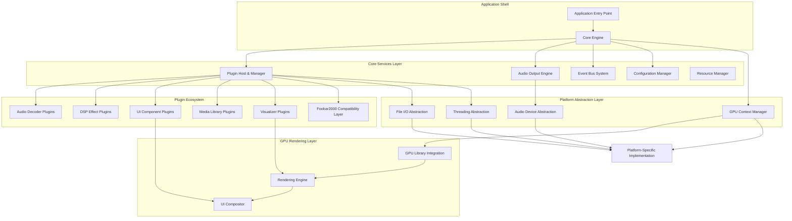
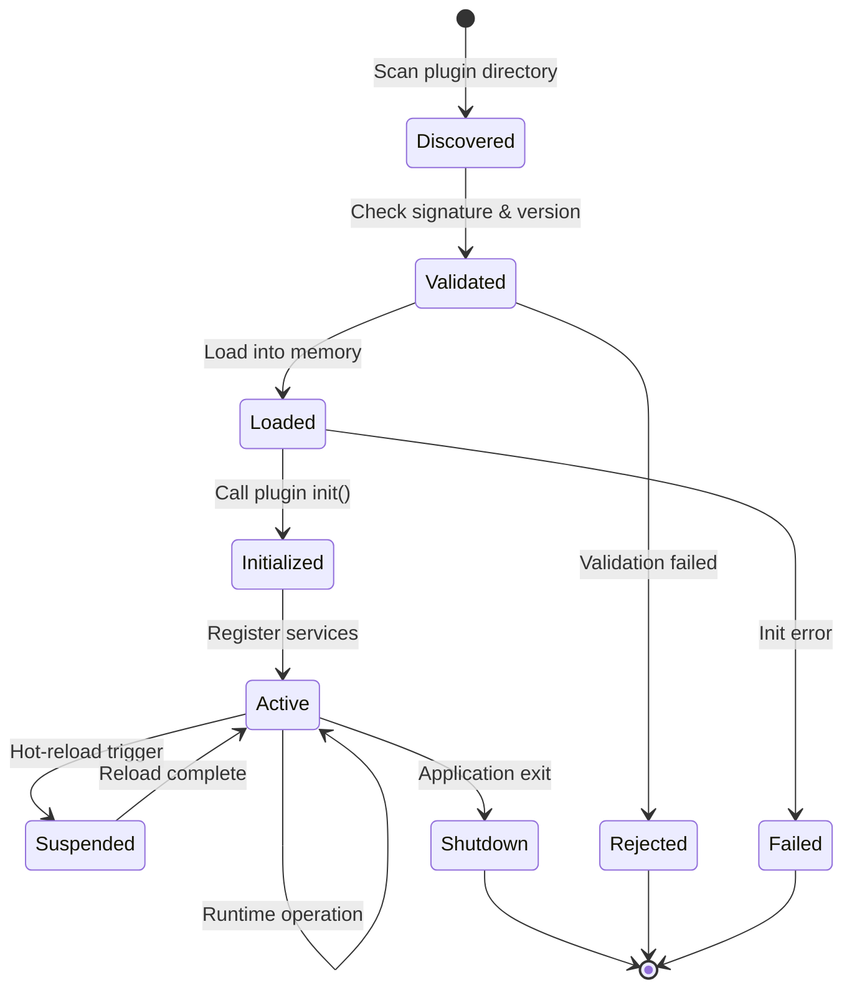
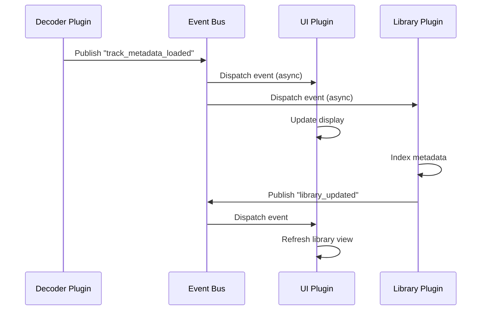
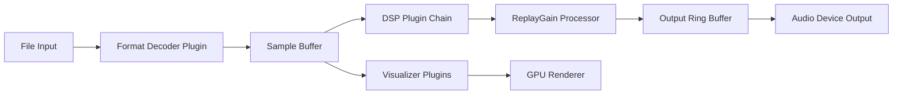
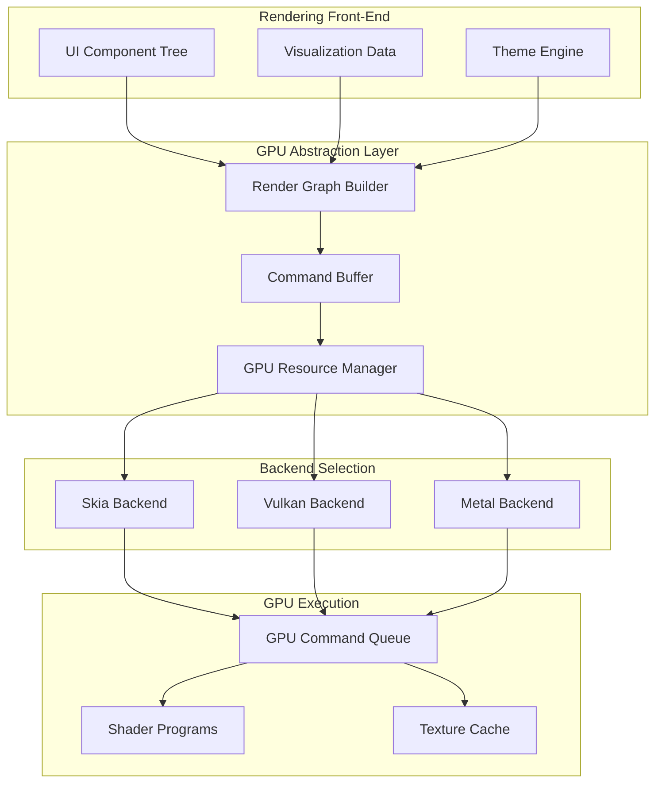
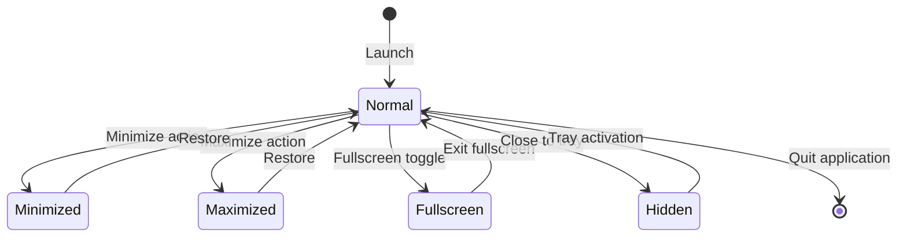
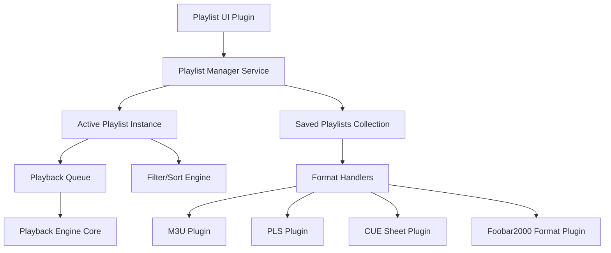
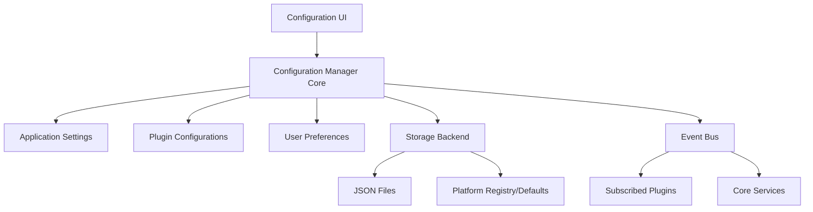
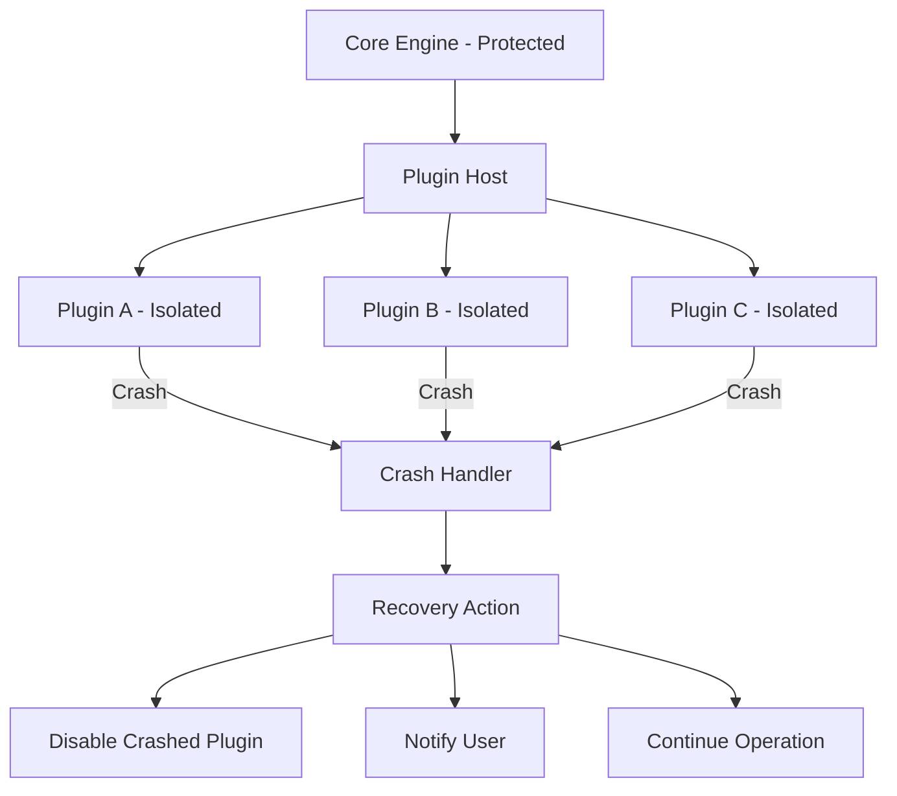

# Professional Music Player - System Design Document

## 1. Project Overview

### 1.1 Vision and Goals

Design a professional, cross-platform music player application that rivals foobar2000 in functionality and extensibility. The system prioritizes minimal core architecture with maximum plugin extensibility, backward compatibility with foobar2000 plugins, and modern GPU-accelerated rendering capabilities.

### 1.2 Core Objectives

- Create a lightweight core engine with essential playback functionality
- Implement comprehensive plugin architecture compatible with foobar2000 ecosystem
- Support cross-platform deployment (Windows, macOS, Linux)
- Enable GPU-accelerated UI rendering and audio visualization
- Provide professional-grade audio processing with support for multiple formats
- Ensure extensibility for future audio format and feature additions through plugins

### 1.3 Success Criteria

- Successfully load and execute foobar2000 plugins without modification
- Achieve smooth 60 FPS UI rendering with GPU acceleration
- Support common audio formats (MP3, FLAC, WAV, AAC, OGG) through core or plugins
- Maintain audio playback latency under 50ms
- Plugin installation and management with zero application restart
- Cross-platform binary compatibility through abstraction layers

## 2. System Architecture

### 2.1 Architectural Style

The system adopts a **Microkernel Architecture** pattern where:
- Minimal core provides essential services (audio output, plugin management, event system)
- All major features delivered through plugins (format decoders, DSP, UI components, library management)
- Plugin host provides standardized interfaces and service discovery
- Inter-plugin communication through message bus and shared services

### 2.2 High-Level Component Structure

### 2.3 Core Components Description

| Component | Responsibility | Key Characteristics |
|-----------|---------------|---------------------|
| **Core Engine** | Lifecycle management, service coordination, bootstrap | Minimal footprint, stateless orchestration |
| **Plugin Host** | Plugin discovery, loading, versioning, dependency resolution | Hot-reload capable, sandboxed execution |
| **Audio Output Engine** | Low-latency audio streaming, format-agnostic playback | Lock-free ring buffer, adaptive buffering |
| **Event Bus** | Asynchronous event distribution, inter-plugin communication | Publish-subscribe pattern, priority queues |
| **Configuration Manager** | Persistent settings, plugin configurations, user preferences | Hierarchical structure, atomic updates |
| **Platform Abstraction Layer** | OS-specific implementations hidden behind unified interfaces | Compile-time selection, zero overhead |
| **GPU Context Manager** | GPU resource lifecycle, rendering context management | Multi-backend support, fallback to CPU |
| **Foobar2000 Compatibility Layer** | API translation, binary interface compatibility | Dynamic library wrapping, ABI versioning |

## 3. Plugin Architecture

### 3.1 Plugin System Design Philosophy

The plugin system follows the principle of "everything is a plugin except the absolute minimum":
- Core provides only: plugin loading, audio output, event routing, resource management
- All features including UI, decoders, library management, DSP delivered via plugins
- Plugins communicate through well-defined interfaces and event bus
- Backward compatibility with foobar2000 SDK maintained through compatibility layer

### 3.2 Plugin Lifecycle

### 3.3 Plugin Interface Specification

#### 3.3.1 Native Plugin Interface

All native plugins must implement the base plugin interface:

| Interface Method | Purpose | Return Contract |
|------------------|---------|-----------------|
| **get_plugin_info()** | Provide metadata (name, version, author, dependencies) | Immutable structure valid for plugin lifetime |
| **initialize()** | Allocate resources, register services with core | Success/failure code, error details |
| **shutdown()** | Clean up resources, deregister services | Must complete within timeout (5s) |
| **get_capabilities()** | Declare supported features and service interfaces | Bitmask of capability flags |
| **get_service()** | Provide service implementation by interface ID | Pointer to service vtable or null |

#### 3.3.2 Foobar2000 Compatibility Interface

The compatibility layer translates foobar2000 plugin calls to native interfaces:

| Foobar2000 Component | Translation Strategy | Compatibility Notes |
|---------------------|---------------------|---------------------|
| **input plugins** | Map to decoder plugin interface | Support component API versions 0.9-2.0 |
| **DSP plugins** | Wrap as native DSP processor | Sample format conversion as needed |
| **visualization** | Bridge to GPU rendering pipeline | Legacy GDI/DirectX wrapped to modern GPU |
| **UI elements** | Integrate into UI plugin system | Layout adaptation for modern themes |
| **playlist handlers** | Map to media library plugin interface | Maintain playlist format compatibility |
| **file system plugins** | Proxy through native file I/O abstraction | Virtual filesystem support |

### 3.4 Plugin Discovery and Loading

#### 3.4.1 Discovery Process

The plugin host scans for plugins at startup and monitors for changes:

1. **Scan Directories**: Search predefined paths for plugin binaries
2. **Metadata Extraction**: Read plugin manifests without full loading
3. **Dependency Resolution**: Build dependency graph, detect conflicts
4. **Version Compatibility**: Check core version requirements
5. **Priority Ordering**: Determine load order based on dependencies
6. **Security Validation**: Verify signatures if security mode enabled

#### 3.4.2 Loading Strategy

| Loading Mode | Trigger | Use Case |
|--------------|---------|----------|
| **Eager Loading** | Application startup | Critical plugins (decoders, output) |
| **Lazy Loading** | First use or explicit request | Optional features (visualizers, utilities) |
| **Hot Loading** | User action or file change | Development mode, plugin updates |
| **Delayed Loading** | After UI initialization | Performance optimization |

### 3.5 Plugin Communication

#### 3.5.1 Service Registration Pattern

Plugins expose functionality by registering services with the core:

- Plugin calls core's service registry during initialization
- Provides service interface ID and implementation pointer
- Other plugins query services by interface ID
- Core manages service lifecycle and mediates access

#### 3.5.2 Event-Driven Communication

| Event Category | Publisher | Subscribers | Delivery Guarantee |
|----------------|-----------|-------------|-------------------|
| **Playback Events** | Core/Decoder | UI, Visualizer, Library | At-least-once |
| **UI Events** | UI Plugins | Core, Other UI Components | Best-effort |
| **Configuration Changes** | Config Manager | All interested plugins | At-least-once, ordered |
| **Library Events** | Library Plugin | UI, Playlist Manager | At-least-once |
| **System Events** | Core | All plugins | Broadcast, best-effort |

## 4. Audio Processing Pipeline

### 4.1 Audio Stream Flow

### 4.2 Audio Format Support Strategy

#### 4.2.1 Core vs. Plugin Format Support

| Format Category | Implementation Strategy | Rationale |
|-----------------|------------------------|-----------|
| **PCM Formats (WAV, AIFF)** | Core built-in decoder | Universally needed, simple implementation |
| **MP3** | Default plugin (bundled) | Patent considerations, replaceable |
| **FLAC** | Default plugin (bundled) | Open format, high demand |
| **AAC/M4A** | Default plugin (bundled) | Common format, library dependency |
| **OGG Vorbis** | Default plugin (bundled) | Open format, library dependency |
| **Exotic Formats** | Third-party plugins | Community-driven, optional |
| **Streaming Protocols** | Plugin-based | Different protocols need different implementations |

#### 4.2.2 Decoder Plugin Interface

Each decoder plugin must implement:

| Interface Method | Input | Output | Purpose |
|------------------|-------|--------|---------|
| **probe_file()** | File header bytes | Confidence score (0-100) | Quick format detection |
| **open_stream()** | File path or stream handle | Decoder instance or error | Initialize decoding session |
| **get_stream_info()** | Decoder instance | Audio properties (sample rate, channels, bit depth, duration) | Stream metadata |
| **decode_block()** | Decoder instance, output buffer size | PCM samples, sample count | Decode next audio block |
| **seek()** | Decoder instance, timestamp | Success/failure, actual position | Random access |
| **close_stream()** | Decoder instance | Void | Release resources |
| **get_metadata()** | File path or decoder instance | Key-value metadata map | Extract tags |

### 4.3 Audio Output Engine

#### 4.3.1 Output Requirements

- Support multiple audio backends per platform (WASAPI/DirectSound on Windows, CoreAudio on macOS, ALSA/PulseAudio on Linux)
- Adaptive buffer sizing based on device latency characteristics
- Gapless playback between tracks
- Bit-perfect output mode for high-fidelity audio
- Sample rate conversion when device doesn't support native rate
- Multi-channel audio support (stereo to 7.1 surround)

#### 4.3.2 Buffering Strategy

| Buffer Component | Size | Purpose |
|------------------|------|---------|
| **Decode Buffer** | 2-5 seconds of audio | Absorb decoder latency spikes |
| **DSP Buffer** | 0.5-1 second | Plugin processing latency |
| **Output Ring Buffer** | 100-500ms | Device callback buffering |
| **Prefetch Buffer** | Next track (gapless mode) | Seamless transitions |

### 4.4 DSP Plugin Chain

#### 4.4.1 DSP Processing Model

DSP plugins process audio samples in configurable order:

- User configures plugin chain order through UI
- Each plugin receives samples, processes, outputs to next in chain
- Plugins can modify sample rate, channel count, or sample format
- Chain reconfigures dynamically when plugins added/removed
- Bypass capability for A/B testing

#### 4.4.2 DSP Plugin Interface

| Interface Method | Responsibility | Constraints |
|------------------|---------------|-------------|
| **get_supported_formats()** | Declare input/output format capabilities | Must support at least one common format |
| **configure()** | Accept configuration parameters | Non-blocking, validates parameters |
| **process()** | Transform audio samples | Real-time safe, no allocations |
| **reset()** | Clear internal state | Called on seek or format change |
| **get_latency()** | Report processing delay in samples | Used for timing corrections |

## 5. GPU Acceleration

### 5.1 GPU Library Selection

The system integrates mature GPU libraries for cross-platform acceleration:

| GPU Library | Use Case | Platform Support | Rationale |
|-------------|----------|------------------|-----------|
| **Skia** | 2D UI rendering, text, vector graphics | Windows, macOS, Linux | Mature, used by Chrome/Firefox, excellent text rendering |
| **Vulkan** | High-performance visualization, effects | Windows, macOS (MoltenVK), Linux | Modern, explicit control, cross-platform |
| **Metal** | macOS/iOS native acceleration | macOS, iOS | Platform-native optimal performance |
| **DirectX 12** (optional) | Windows-specific optimizations | Windows 10+ | Optional for Windows-specific features |

### 5.2 GPU Rendering Architecture

### 5.3 GPU Feature Utilization

#### 5.3.1 UI Rendering

| Feature | GPU Acceleration Benefit | Implementation Approach |
|---------|-------------------------|-------------------------|
| **Text Rendering** | Cached glyph atlases, subpixel rendering | Skia's GPU-accelerated text pipeline |
| **Window Composition** | Layered rendering, transparency, blur effects | GPU compositing with shader effects |
| **Smooth Scrolling** | 60+ FPS list scrolling with thousands of items | Virtualized rendering, GPU transforms |
| **Theme Rendering** | Real-time style updates, gradient fills | GPU shader-based rendering |
| **Animations** | Smooth transitions, fades, transforms | GPU-accelerated animation engine |

#### 5.3.2 Audio Visualization

| Visualization Type | GPU Technique | Data Source |
|-------------------|---------------|-------------|
| **Spectrum Analyzer** | FFT on GPU, real-time bar/line rendering | Raw PCM from audio buffer |
| **Waveform Display** | Vertex buffer streaming, instanced rendering | Decoded audio samples |
| **Oscilloscope** | Line rendering with shader effects | Real-time audio output |
| **3D Visualizations** | Particle systems, mesh deformation | FFT bands, beat detection |
| **Album Art Effects** | Blur, color extraction, transitions | Texture sampling and processing |

### 5.4 GPU Resource Management

#### 5.4.1 Resource Lifecycle

- Lazy allocation: Resources created on first use
- Automatic pooling: Reuse buffers and textures across frames
- LRU eviction: Remove unused resources when memory pressure detected
- Async loading: Texture uploads off main thread
- Fallback handling: Graceful degradation when GPU unavailable

#### 5.4.2 Performance Targets

| Metric | Target | Mitigation Strategy |
|--------|--------|-------------------|
| **Frame Rate** | Stable 60 FPS | V-sync, frame pacing, profiling |
| **GPU Memory** | < 256 MB for UI | Texture compression, atlas packing |
| **Startup Time** | < 2 seconds to first frame | Lazy shader compilation, cached pipelines |
| **Power Efficiency** | Minimize GPU usage when idle | Adaptive refresh rate, dirty region tracking |

## 6. User Interface Architecture

### 6.1 UI Design Philosophy

- Modern, clean interface with professional aesthetics
- Theme support for visual customization without structural changes
- Responsive layout adapting to window size
- Accessibility support (keyboard navigation, screen readers, high contrast)
- Consistent cross-platform experience with platform-specific conventions

### 6.2 UI Component Plugin System

#### 6.2.1 Component Categories

| Component Type | Provided By | Lifecycle | Examples |
|----------------|-------------|-----------|----------|
| **Core UI Framework** | Core engine | Application lifetime | Window manager, layout engine, input handling |
| **Standard Components** | Bundled UI plugin | Application lifetime | Playback controls, playlist view, library browser |
| **Optional Components** | Optional plugins | User-controlled | Lyrics display, album art viewer, equalizer UI |
| **Custom Components** | Third-party plugins | User-controlled | Custom visualizers, info panels, utilities |

#### 6.2.2 UI Plugin Interface

| Interface Capability | Description | Plugin Responsibility |
|---------------------|-------------|----------------------|
| **create_view()** | Instantiate UI component | Return renderable view object |
| **get_layout_constraints()** | Declare size preferences | Minimum, maximum, preferred dimensions |
| **handle_event()** | Process user input | Keyboard, mouse, touch events |
| **render()** | Draw component content | Use GPU rendering API |
| **update_state()** | React to data changes | Respond to event bus notifications |
| **serialize_state()** | Save user customizations | Window position, column widths, etc. |

### 6.3 Layout and Window Management

#### 6.3.1 Layout System

The UI uses a flexible layout system:

- Hierarchical layout tree with containers and leaf components
- Constraint-based sizing (minimum, maximum, preferred dimensions)
- Splitters for user-resizable regions
- Tab containers for multi-view areas
- Docking system for component rearrangement (optional)

#### 6.3.2 Window States

### 6.4 Theme System

#### 6.4.1 Theme Architecture

Themes control visual presentation without changing layout structure:

| Theme Element | Customizable Attributes | Application Method |
|---------------|------------------------|-------------------|
| **Color Palette** | Background, foreground, accent, semantic colors | Applied to all UI components |
| **Typography** | Font families, sizes, weights for different text types | Text rendering system |
| **Spacing** | Padding, margins, component gaps | Layout engine parameters |
| **Effects** | Shadows, blur, transparency levels | GPU shader parameters |
| **Icons** | Icon set selection | Resource lookup override |

#### 6.4.2 Theme Hot-Reload

- Theme changes apply immediately without restart
- Smooth transition animations between themes
- Preserve user customizations across theme switches
- Theme preview before application

## 7. Media Library and Playlist Management

### 7.1 Library Architecture

Media library functionality implemented entirely through plugins:

| Library Component | Implementation | Responsibility |
|-------------------|----------------|----------------|
| **File Scanner** | Plugin | Monitor directories, detect new/changed files |
| **Metadata Indexer** | Plugin | Extract and index audio file metadata |
| **Database Backend** | Plugin (swappable) | Store library data (SQLite default) |
| **Query Engine** | Plugin | Search and filter library |
| **Library UI** | Plugin | Browse and organize collection |

### 7.2 Playlist System

#### 7.2.1 Playlist Architecture

#### 7.2.2 Playlist Capabilities

| Feature | Implementation Strategy | Plugin Extensibility |
|---------|------------------------|---------------------|
| **Multiple Playlists** | Playlist manager maintains collection | Plugins can register custom playlist types |
| **Playlist Formats** | Format-specific plugins for load/save | New formats via plugins |
| **Smart Playlists** | Query-based dynamic playlists | Custom query providers |
| **Playlist Editing** | Cut/copy/paste, drag-drop, sorting | UI plugins extend editing capabilities |
| **Undo/Redo** | Command pattern for playlist modifications | All changes reversible |
| **Playlist Metadata** | Embedded or sidecar metadata storage | Plugin-defined metadata schemas |

### 7.3 Library Database Schema (Logical Model)

| Entity | Key Attributes | Purpose |
|--------|----------------|---------|
| **Track** | file_path, file_hash, duration, sample_rate, bitrate, channels | Core audio file information |
| **Metadata** | track_id, key (title, artist, album, etc.), value | Flexible key-value metadata |
| **Playlist** | playlist_id, name, type, query (for smart playlists) | Playlist definitions |
| **PlaylistItem** | playlist_id, track_id, position, custom_metadata | Playlist membership |
| **LibraryFolder** | path, monitored, recursive, last_scan | Monitored directory configuration |
| **AlbumArt** | track_id or album_id, image_data or path, type | Cover art storage |

### 7.4 Metadata Handling

#### 7.4.1 Metadata Sources

Priority order for metadata resolution:

1. Embedded file tags (ID3, Vorbis Comments, APE tags, etc.)
2. External metadata files (sidecar JSON, XML)
3. Online metadata services (plugin-based)
4. Filename parsing (fallback)
5. User overrides (highest priority when present)

#### 7.4.2 Metadata Writing Strategy

| Scenario | Write Strategy | Rationale |
|----------|---------------|-----------|
| **Lossless Formats** | Write to file tags | Standard practice, portable |
| **Lossy Formats** | Write to file tags if safe | Avoid reencoding |
| **Read-Only Files** | External sidecar files | Preserve original files |
| **User Preference** | Configurable per-format | Flexibility for different workflows |
| **Bulk Operations** | Batched writes with transaction | Performance optimization |

## 8. Configuration and Persistence

### 8.1 Configuration Architecture

### 8.2 Configuration Scope

| Scope | Storage Location | Examples | Access Pattern |
|-------|-----------------|----------|----------------|
| **Application Settings** | App config directory | Window layout, theme choice, startup behavior | Read at startup, write on change |
| **Plugin Settings** | Plugin-specific config files | Decoder options, DSP parameters, UI preferences | Plugin-managed, core provides storage API |
| **User Preferences** | User profile directory | Keybindings, playback settings, library paths | Frequently accessed, cached in memory |
| **Playback State** | Session state file | Current track, position, playlist, volume | Written periodically, restored on startup |
| **Library Data** | Database files | Track metadata, playlists, statistics | Database-managed, plugin access |

### 8.3 Configuration Change Notification

When configuration changes:

1. Configuration manager validates new values
2. Atomic update of in-memory configuration
3. Event published to event bus with change details
4. Affected plugins receive notification
5. Asynchronous write to persistent storage
6. Change confirmation to UI if applicable

## 9. Cross-Platform Strategy

### 9.1 Platform Abstraction Design

#### 9.1.1 Abstraction Layer Responsibilities

| Platform Feature | Abstraction Interface | Platform-Specific Implementations |
|------------------|----------------------|----------------------------------|
| **File System** | Virtual file I/O API | Windows file API, POSIX on macOS/Linux, UNC paths |
| **Threading** | Thread pool, synchronization primitives | Windows threads, pthreads, C++11 std::thread |
| **Audio Output** | Audio device enumeration and streaming | WASAPI, DirectSound (Windows), CoreAudio (macOS), ALSA, PulseAudio (Linux) |
| **GPU Context** | Rendering context management | D3D/Vulkan (Windows), Metal/Vulkan (macOS), Vulkan/OpenGL (Linux) |
| **Window System** | Window creation, events, input | Win32 API (Windows), Cocoa (macOS), X11/Wayland (Linux) |
| **System Integration** | Tray icon, media keys, notifications | Platform-specific notification APIs |

### 9.2 Build and Deployment Strategy

#### 9.2.1 Build System

| Aspect | Approach | Rationale |
|--------|----------|-----------|
| **Build Tool** | CMake | Industry standard, cross-platform, IDE integration |
| **Compiler Support** | MSVC, Clang, GCC | Platform-native compilers |
| **Dependency Management** | vcpkg or Conan | Reproducible cross-platform dependencies |
| **Build Configurations** | Debug, Release, RelWithDebInfo | Standard configurations |
| **Continuous Integration** | Multi-platform CI pipeline | Ensure cross-platform compatibility |

#### 9.2.2 Binary Distribution

| Platform | Package Format | Distribution Method |
|----------|---------------|---------------------|
| **Windows** | Installer (NSIS/WiX), Portable ZIP | Direct download, Windows Package Manager |
| **macOS** | DMG, PKG installer | Direct download, Homebrew |
| **Linux** | AppImage, DEB, RPM, Flatpak | Direct download, distribution repositories |

### 9.3 Platform-Specific Considerations

#### 9.3.1 Windows

- Use WASAPI in exclusive mode for bit-perfect audio
- DirectX 12 optional for advanced visualizations
- Windows media key integration
- Microsoft Store distribution option
- High-DPI awareness and per-monitor scaling

#### 9.3.2 macOS

- Metal as primary GPU backend for optimal performance
- CoreAudio for low-latency audio
- macOS media key and Touch Bar integration
- Sandboxing considerations for App Store distribution
- Retina display support and automatic scaling

#### 9.3.3 Linux

- Multiple audio backend support (user selectable)
- Vulkan primary GPU backend with OpenGL fallback
- Desktop integration (D-Bus, MPRIS)
- Distribution-agnostic packaging with AppImage
- Wayland and X11 support

## 10. Performance and Scalability Requirements

### 10.1 Performance Targets

| Metric | Target | Measurement Method |
|--------|--------|-------------------|
| **Startup Time** | < 2 seconds cold start | Time to playable UI |
| **Memory Footprint** | < 100 MB base, < 500 MB with large library | Process working set |
| **CPU Usage (Playback)** | < 5% single core at 1x speed | Average during playback |
| **UI Responsiveness** | 60 FPS sustained, < 16ms frame time | Frame timing profiler |
| **Library Scan Speed** | > 1000 files/second | Benchmark on SSD |
| **Seek Latency** | < 200ms for local files | User-perceptible delay |
| **Gapless Transition** | 0ms audible gap | Audio analysis |

### 10.2 Scalability Considerations

#### 10.2.1 Large Library Support

The system must handle libraries with 100,000+ tracks:

- Efficient database indexing strategies
- Virtual scrolling for playlist display
- Incremental loading of metadata
- Background indexing without blocking UI
- Optimized query execution plans
- Metadata caching in memory with LRU eviction

#### 10.2.2 Plugin Ecosystem Scaling

Support for 50+ simultaneously loaded plugins:

- Lazy plugin initialization
- Plugin sandbox isolation to prevent interference
- Resource quotas per plugin (memory, CPU)
- Plugin performance monitoring and profiling
- Automatic disable of misbehaving plugins
- Plugin dependency graph optimization

### 10.3 Resource Management

| Resource Type | Management Strategy | Limits |
|---------------|-------------------|--------|
| **Memory** | Pools for frequent allocations, arena allocators for short-lived objects | Monitor and warn at 80% system memory |
| **File Handles** | Connection pooling, auto-close unused handles | Platform limits respected |
| **Threads** | Bounded thread pool, work stealing scheduler | 2x CPU cores for compute tasks |
| **GPU Memory** | Texture atlases, buffer pooling, LRU eviction | < 256 MB baseline |
| **Network Connections** | Connection pooling for streaming plugins | Configurable per plugin |

## 11. Security and Stability

### 11.1 Plugin Security Model

#### 11.1.1 Plugin Trust Levels

| Trust Level | Restrictions | Verification |
|-------------|--------------|--------------|
| **Trusted (Bundled)** | No restrictions | Signed by application developers |
| **Verified Third-Party** | Standard restrictions | Code signing certificate validation |
| **Unverified** | Sandboxed execution (optional) | User acknowledgment required |
| **Development** | Developer mode only | No verification |

#### 11.1.2 Plugin Sandbox Capabilities

For security-sensitive deployments, plugins can be sandboxed with:

- Restricted file system access (only configured directories)
- Network access control (allow/deny per plugin)
- Memory limits and CPU quotas
- IPC restrictions (only through core-provided APIs)
- Privilege separation (plugins run with reduced permissions)

### 11.2 Crash Recovery and Stability

#### 11.2.1 Fault Isolation

#### 11.2.2 Stability Mechanisms

| Mechanism | Purpose | Implementation |
|-----------|---------|----------------|
| **Exception Boundaries** | Prevent plugin crashes from affecting core | Try-catch wrappers around plugin calls |
| **Watchdog Timers** | Detect hung plugins | Timeout monitoring for plugin operations |
| **State Persistence** | Recover playback state after crash | Periodic state snapshots |
| **Plugin Blacklist** | Disable repeatedly crashing plugins | Automatic disable after 3 crashes |
| **Crash Reporting** | Diagnostic information collection | Optional anonymous crash reports |
| **Safe Mode** | Startup without plugins | Fallback when normal startup fails |

### 11.3 Data Integrity

- Atomic writes for configuration files (write-temp-rename pattern)
- Database transactions for library modifications
- Playlist backup before modifications
- Checksum verification for critical data files
- Graceful handling of corrupt files (skip and report)

## 12. Extensibility and Future Considerations

### 12.1 Plugin API Versioning

- Semantic versioning for plugin API (major.minor.patch)
- Backward compatibility maintained within major versions
- Deprecation warnings for API changes
- Migration guides for major API updates
- Multiple API versions supported simultaneously during transitions

### 12.2 Planned Extension Points

| Extension Area | Plugin Capability | Use Cases |
|----------------|------------------|-----------|
| **Network Protocols** | Custom streaming protocol handlers | Internet radio, cloud storage integration |
| **Metadata Providers** | Online metadata lookup services | MusicBrainz, Last.fm, Discogs integration |
| **Output Devices** | Custom audio output backends | Network streaming, custom hardware |
| **Input Devices** | Alternative input sources | CD ripping, recording, capture |
| **Scripting** | Embedded scripting language support | User automation, custom behaviors |
| **Remote Control** | Network APIs for remote control | Mobile apps, web interfaces, home automation |

### 12.3 Architectural Evolution Path

#### Phase 1: Foundation (MVP)
- Core engine with plugin host
- Audio output and basic decoder plugins
- Simple UI with playback controls
- Foobar2000 input plugin compatibility layer

#### Phase 2: Feature Completeness
- Full GPU-accelerated UI
- Complete DSP plugin chain
- Media library and playlist system
- Comprehensive visualizations
- All foobar2000 plugin types supported

#### Phase 3: Advanced Features
- Network streaming capabilities
- Mobile companion apps
- Advanced DSP and room correction
- Cloud integration
- Community plugin marketplace

### 12.4 Open Questions and Future Research

| Topic | Question | Impact |
|-------|----------|--------|
| **Plugin Marketplace** | Centralized plugin distribution and discovery? | Community growth, plugin quality |
| **Cloud Sync** | Sync library and playlists across devices? | User convenience, privacy considerations |
| **Mobile Platform** | iOS/Android versions with shared core? | Market reach, code reuse |
| **Streaming Services** | Integration with Spotify, Tidal, etc.? | User value, licensing complexity |
| **AI Features** | Smart playlists, audio enhancement, recommendation? | Differentiation, computational cost |
| **Advanced DSP** | Room correction, headphone EQ profiles? | Audiophile appeal, complexity |

## 13. Development Workflow and Tooling

### 13.1 Development Environment

| Tool Category | Recommended Tools | Purpose |
|---------------|------------------|---------|
| **IDE** | Visual Studio, CLion, VSCode | Development and debugging |
| **Build System** | CMake 3.20+ | Cross-platform build management |
| **Version Control** | Git | Source code management |
| **Debuggers** | Platform debuggers, GDB, LLDB | Debugging and profiling |
| **Profilers** | Tracy, Instruments, Visual Studio Profiler | Performance analysis |
| **Memory Analysis** | Valgrind, AddressSanitizer | Memory leak and error detection |
| **Documentation** | Doxygen | Code documentation generation |

### 13.2 Code Organization

Recommended directory structure:

- **/core** - Core engine implementation
- **/platform** - Platform abstraction layer
- **/plugins** - Bundled plugins
  - **/decoders** - Audio format decoders
  - **/dsp** - DSP effects
  - **/ui** - UI components
  - **/library** - Media library
  - **/foobar_compat** - Foobar2000 compatibility layer
- **/gpu** - GPU rendering engine
- **/sdk** - Plugin development SDK
  - **/headers** - Public API headers
  - **/examples** - Example plugins
  - **/docs** - API documentation
- **/tests** - Unit and integration tests
- **/tools** - Build and development utilities
- **/external** - Third-party dependencies

### 13.3 Testing Strategy

| Test Type | Coverage | Tools |
|-----------|----------|-------|
| **Unit Tests** | Core components, utilities, algorithms | Google Test, Catch2 |
| **Integration Tests** | Plugin loading, audio pipeline, UI components | Custom test framework |
| **Performance Tests** | Benchmark critical paths, regression detection | Google Benchmark |
| **Platform Tests** | Platform abstraction layer on all platforms | CI on multiple platforms |
| **Plugin Compatibility** | Foobar2000 plugin compatibility verification | Automated plugin test suite |
| **User Acceptance** | Manual testing of complete workflows | Test plan and bug tracking |

### 13.4 Documentation Requirements

| Documentation Type | Audience | Content |
|-------------------|----------|---------|
| **Architecture Docs** | Developers, maintainers | System design, component interaction |
| **API Reference** | Plugin developers | Complete API documentation with examples |
| **Plugin Development Guide** | Plugin developers | Tutorial, best practices, SDK usage |
| **User Manual** | End users | Features, configuration, troubleshooting |
| **Build Instructions** | Contributors | Platform-specific build steps |
| **Contribution Guidelines** | Contributors | Code style, PR process, testing requirements |

## 14. Risk Assessment and Mitigation

| Risk | Likelihood | Impact | Mitigation Strategy |
|------|-----------|--------|---------------------|
| **Foobar2000 Plugin Compatibility** | Medium | High | Early prototyping of compatibility layer, test with popular plugins, phased compatibility goals |
| **Cross-Platform GPU Differences** | Medium | Medium | Abstraction layer, fallback rendering paths, extensive testing on all platforms |
| **Performance Degradation** | Low | High | Continuous profiling, performance budgets, optimization sprints |
| **Plugin Ecosystem Fragmentation** | Medium | Medium | Clear SDK documentation, stable API guarantees, plugin developer community |
| **Audio Quality Issues** | Low | High | Bit-perfect output mode, extensive audio testing, audiophile community feedback |
| **Scope Creep** | High | High | Phased development plan, clear MVP definition, feature prioritization |
| **Third-Party Library Dependencies** | Medium | Medium | Vendor source code when critical, abstraction layers, license compliance |
| **Security Vulnerabilities** | Medium | High | Code review, security audits, sandboxing for untrusted plugins, responsible disclosure |

## 15. Success Metrics

### 15.1 Technical Metrics

- All bundled decoders achieve < 5% CPU usage during playback
- UI maintains 60 FPS with 10,000 item playlists
- Successfully loads and executes 20+ popular foobar2000 plugins
- Startup time under 2 seconds on mid-range hardware
- Zero audio dropouts during 24-hour continuous playback test

### 15.2 User Experience Metrics

- User can play audio file within 30 seconds of first launch
- Library import speed exceeds user expectations (> 1000 files/sec)
- No learning curve for basic playback operations
- Advanced features discoverable without documentation
- Cross-platform feature parity achieved

### 15.3 Ecosystem Metrics

- Plugin SDK documentation completeness (100% API coverage)
- Third-party plugin compatibility rate (> 80% of top foobar2000 plugins)
- Community plugin submissions within first year
- Active developer community participation

## 16. Implementation Priorities

### 16.1 Critical Path Components

Highest priority for initial implementation:

1. **Core Engine** - Application lifecycle, service registry, event bus
2. **Platform Abstraction** - File I/O, threading, basic audio output
3. **Plugin Host** - Plugin loading, lifecycle management
4. **Basic Audio Pipeline** - WAV decoder, output engine, gapless playback
5. **Minimal UI** - Window, playback controls, playlist view
6. **Foobar2000 Input Plugin Compatibility** - Load and execute foobar decoders

### 16.2 Secondary Components

Important but not blocking initial prototype:

- GPU rendering integration
- Full DSP chain
- Media library and database
- Advanced UI components
- Complete foobar2000 plugin type support
- Theme system

### 16.3 Tertiary Components

Valuable but deferrable to later phases:

- Network streaming
- Advanced visualizations
- Plugin marketplace
- Cloud integration
- Mobile apps
- AI-powered features
